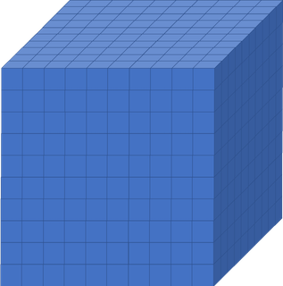

## What is software performance?

Before getting into the software side of things, lets take a few steps back. The concept
of performance is generic and can apply to many factors in our lives, such as our own
physical and mental performance. With *software performance* the emphasis is not on the
using the most powerful machine, but on how best to utilise the power that you have.

Say you are the chef in a restaurant and every dish that you do is perfect. You would be
able to produce a set 7 course meal for a table of 3-6 without too much difficulty. If
you catering a conference dinner though, it becomes more difficult, as people would be
waiting many hours for their food. However, if you could delegate tasks to a team of 6
additional chefs who could assist you (while also communicating with each other), you
have a much higher chance of getting the food out on time and coping with a large
workload. With 7 courses and a total of 7 chefs, it's most likely that each chef will
spend most of their time concentrating on doing one course.

When we dramatically increase the workload we need to distribute it *efficiently* over
the resources we have available so that we can get the desired result in a reasonable
amount of time. That is the essence of software performance, using the resources you
have to the best of their capabilities.

## Why is software performance important?

This is potentially a complex question but has a pretty simple answer when we restrict
ourselves to the context of this lesson. Since the focus here is our *usage* of
software that is developed by someone else, we can take a self-centred and simplistic
approach: all we care about is **reducing the time to solution** to an acceptable level
while **minimising our resource usage**.

This lesson is about taking a well-informed, systematic approach on how to do this.

> ## Enchancing performance: rationale
>
> Imagine you had a `10x10x10` box like the one below, divided up into smaller boxes,
> each measuring `1x1x1`. In one hour, one CPU core can simulate one hour of activity
> inside the smaller box. If you wanted to simulate what was happening inside the large
> box for 8 hours, how long will the example below take to run if we only use one CPU
> core?
>
> 
>
> {: language-bash}
>
>> ## Solution
>>
>> 8000 hours...close to a year!
>>
>> This is way longer than anyone could bear! But remember, that is utilising just one
>> core. If you had a machine that could simulate each of those smaller boxes
>> simultaneously and a code that enables each box to effectively interact with each
>> other, the whole job would only take roughly an hour (but probably a little more).
>>
>{: .solution}
{: .challenge}

## How is performance measured?

There are a number of key terms in computing when it comes to understanding performance
and expected duration of tasks. The most important of these are **walltime**, **flops**
and **CPU hours**.

> ## Walltime
>
> Walltime is simply the length of time, usually measured in seconds, that a program
> takes to run (i.e., to execute its assigned tasks). It is not directly related to the
> resources used, it's simply the time it takes according to an independent clock on the
> wall.
>
{: .callout}

> ## Flops
>
> Flops (of flop/s) stands for floating point operations per second and they are
> typically used to measure the (theoretical) performance of a computer's processor.
>
> The theoretical peak flops is given by
>
> `Number of cores * Average frequency * Operations per cycle`
>
> What a software program can *achieve* in terms of flops is usually a surprisingly
> small percentage of this value (e.g., 10% efficiency is not a bad number!).
>
> Since in our case we don't develop or compile the code, the only influence we have
> on the flops achieved by the application is by dictating the choices it makes during
> execution (sometimes called telling it what *code path* to walk).
>
{: .callout}

> ## Calculate Flops
>
> Can you find how many flops your computer is capable of at maximum efficiency?
>
{: .challenge}

> ## CPU Hours
>
> CPU hours is the amount of CPU time spent processing. For example, if I execute for a
> walltime of 1 hour on 10 CPUs, then I will have used up 10 CPU hours.
>
> Maximising the flops of our application will help reduce the CPU hours, since we
> will squeeze more calculations out of the same CPU time. However, you can achieve much
> greater influence on the CPU hours by using a better algorithm to get to your result.
> The best algorithm choice is usually heavily dependent on your particular use case
> (and you are always limited by what algorithm options are available in the software).
>
{: .callout}


> ## Calculate CPU hours
>
> In the following example, assume that you are utilising all the available core in a
> node. Calculate the CPU hours requested to run the following job.
>
> ```
> {{ site.sched_comment }} {{ site.sched_flag_nodes }} = 2
> {{ site.sched_comment }} {{ site.sched_flag_time }} = 05:00:00
> ```
> {: .bash}
>
>> ## Solution
>>
>> 400 CPU hours.
>>
>{: .solution}
{: .challenge}

The `{{ site.sched_flag_time }}` variable used in the exercise is the **maximum** amount
of walltime requested, which will differ from the actual walltime the code spends to
run.

> ## Requested CPU vs. Actual CPU
>
> See the following LAMMPS output log file and the submission script file. What is the
> requested walltime, the requested CPU hours and the actual CPU hours?
>
> ```
> run script
> ```
> {: .bash}
>
> ```
> LAMMPS output
> ```
> {: .bash}
>
> `{{ site.exec_env_gpu }}`
>
> ```
> {{ site.exec_env_gpu }}
> ```
> {: .bash}
>
>> ## Solution
>>
>>
>>
>{: .solution}
{: challenge}

## How can performance be enhanced?

You are the code *users*, not code *developers*, to enhance the code performance you
need to trigger behaviour in the software that the *developers* will have put in place
to *potentially* improve performance. To do that, you need to know what the triggers are
and then try them out with your use case to see if they really do improve performance.

Some triggers will be hardware related, like the use of OpenMP, MPI, or GPUs. Others
might relate to alternative libraries or algorithms that could be used by the
application.

> ## Enhancing Performance
>
> Which of these are viable ways of enhancing performance? There may be more than one
> correct answer.
>
> 1. Utilising more CPU cores and nodes
> 2. Increasing the simulation walltime
> 3. Reduce the frequency of file writing in the code
> 4. Having a computer with higher flops
>
>> ## Solution
>> 1. Yes, potentially, the more cores and nodes you have, the more work can be
>>    distributed across those cores...but you need to ensure they are being used!
>> 2. No, increasing simulation walltime only increases the possible duration the code
>     will run for. It does not improve the code performance.
>> 3. Yes, IO is a very common *bottleneck* in software, it can be very expensive (in
>>    terms of time) to write files. Reducing the frequency of file writing can have a
>>    surprisingly large impact.
>> 4. Yes, the faster the computer, the faster the code can run. However, you may not be
>>    able to find a computer with higher flops, since higher individual CPU flops need
>>    disproportionately more power to run (so are not well suited to an HPC system).
>>
>>    In an HPC system, you will usually find a *lot* of lower flop cores because they
>>    make sense in terms of the use of electrical energy. This surprises people because
>>    when they move to an HPC system, they may initially find that their code is slower
>>    rather than faster. However, this is usually not about the resources but managing
>>    their understanding and expectations of them.
>>
>> As you can see, there are a lot of right answers, however some methods work better
>> than others, and it can entirely depend on the problem you are trying to solve.
>>
>{: .solution}
{: .challenge}

**FIXME** This really needs an intro

> ## Increasing CPU core count
>
> Say you've actually got a powerful desktop with multiple CPU cores and a GPU at your
> disposal, what are good options for leveraging them?
>
> 1. Utilising MPI (Message Passing Interface)
> 2. Utilising OpenMP (Open Multi-Processing)
> 3. Using performance enhancing libraries
> 4. Use GPUs instead of CPUs
> 5. Splitting code up into smaller segments that can be run sequentially
>
>> ## Solution
>> 1. Yes, MPI can enable you to split your code into multiple processes distributed
>>    over multiple cores (and even multiple computers), known as parallel programming.
>>    This won't help you to use the GPU though.
>> 2. Yes, like MPI this is also parallel programming, but deals with threads instead of
>     processes, by splitting a process into multiple threads, each thread using a
>     single CPU core. OpenMP can potentially also leverage the GPU.
>> 3. Yes, that is their purpose. However, different libraries run on different
>>    architectures and with different capabilities, in this case you need a library
>>    that will leverage the additional cores and/or the GPU for you.
>> 4. Yes, GPUs are better at handling multiple simple tasks, whereas a CPU is better
>>    at running complex singular tasks quickly.
>> 5. No, if you have a simulation that needs to be run from start to completion,
>>    splitting the code into segments won't be of any benefit and will likely waste
>>    compute resources due to the associated overhead.
>{: .solution}
{: .challenge}


