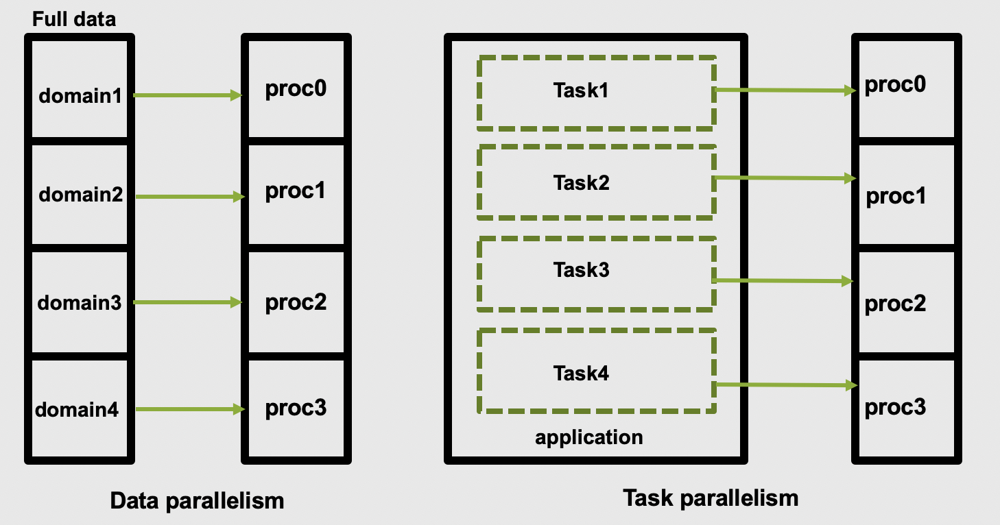
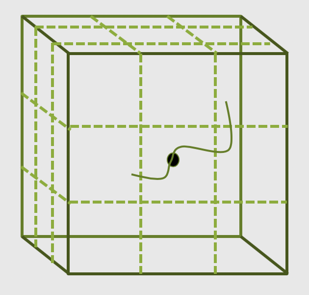
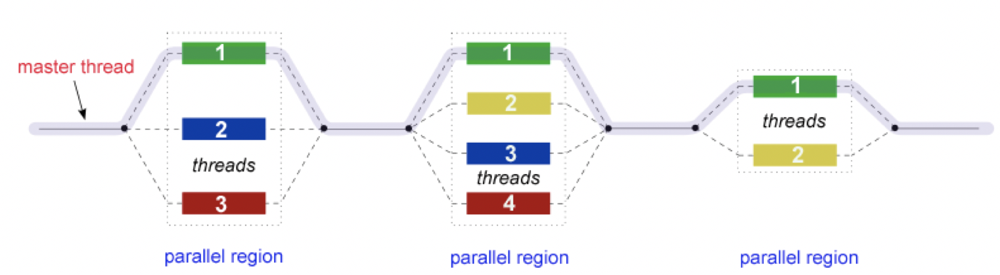
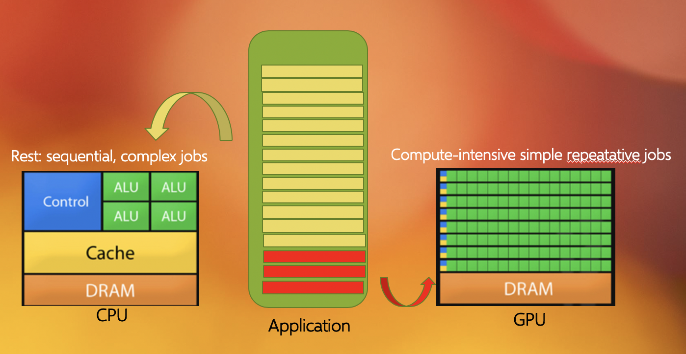

## Accelerating performance

To speed up a calculation in a computer you can either use a faster processor or use multiple
processors to do parallel processing. Increasing clock-speed indefinitely is not possible, so the
best option is to explore parallel computing. Conceptually this is simple: split the computational
task across different processors and run them all at once, hence you get the speed-up.

In practice, however, this involves many complications. Consider the case when you are having just
a single CPU core, associated RAM (primary memory: faster access of data), hard disk (secondary
memory: slower access of data), input (keyboard, mouse) and output devices (screen).

Now consider you have two or more CPU cores, you would notice that there are many things that you
need to take care of:

1. If there are two cores there are two possibilities: Either these two cores share the same RAM
   (shared memory) or each of these cores have their own RAM (private memory).
2. In case these two cores share the same RAM and tend write at once, what would happen? This will
   create a race condition and the programmer needs to be very careful to avoid such situations!
3. How these cores are going to access the memory space?
4. How to divide and distribute the jobs among these two cores?
5. How these two cores will communicate with each other?
6. After the job is done where the final result will be saved? Is this the storage of core 1 or
   core 2? Or, will it be a central storage accessible to both?

## Shared memory vs Distributed memory

When a system has a central memory and each CPU core has a uniform access to this memory space it
is known as a shared memory platform. However, when you partition this central memory and assign
each partition as a private memory space to each CPU core, then we call this a distributed memory
platform. A graphical could be as shown below:

<p align="center"></p>

Depending upon what kind of memory a computer has, the parallelization approach of a code could
vary. For example, in a distributed memory platform, when a CPU core accesses data from its private
memory, it is fastest. But if this requires access to a data that resides in the private memory
space assigned to another CPU core then it requires a ‘communication’ protocol and data access
becomes slower. Therefore while coding or using a code that offers such fine control over memory
space access you need to pay extra attention such that bulk data could be accessed by a CPU core
from its own private memory space.

Similar situation arises for GPU coding too. In this case, the CPU is generally called the host and
the GPUs are called the devices. When we submit a GPU job, it is launched in the CPU (host) which
in turn directs it to be executed by the GPU cores (devices). While doing these calculations, data
is copied from CPU memory to GPU’s first and processed subsequently. After finishing a calculation
by a GPU, the result is copied back from the GPU to CPU. This communication process is expensive
and it could significantly slow down a calculation if care is not taken to minimize this
communication. We’ll see later in this tutorial that communication is a major bottleneck in many
LAMMPS calculations and we need to device strategies to reduce this communication overhead.  

On the contrary, in shared memory platforms, the central memory is being shared by all the
processors. In this case, the processors communicate with each other through the shared memory.

When we say that we accelerate a job by parallelizing it, we actually mean a strategy that divides
the whole job into pieces and assign each piece to a worker (CPU core) to solve. This
parallelization strategy also depends on the memory structure. (as discussed above) of your
computing system. For example, OpenMP provides a thread level parallelism that is well-suited for a
shared memory platform, but you can not use it in a distributed memory system. For a distributed
memory system, you need a message passing protocol like MPI to communicate between processors.

The two main parallelization strategies are data parallelism and task parallelism. In data
parallelism same set of tasks are performed by each core on different subsets of the same data. You
need to take extra care to eliminate data dependencies in data parallelism. On the contrary, when a
task consists of multiple independent sub-tasks, each of which assigned to different cores to do
the job, this is known as task parallelism. In one sentence, in task parallelism different
independent sub-tasks are performed on the same or different data. A simple graphical
representation is given below:

<p align="center"></p>


> ## Process vs. Threads
>
> Just imagine that you are doing some work with both of your hands. You are a process and your
> hands are the threads. In a program, threads are separate points of execution and depending on
> the circumstances these two threads either can work synchronously or in asynchronous manner.
>
{: .callout}

## Multithreading

Multithreading allows a single process to contain multiple threads which share the process's
resources but execute independently. This is important since it allows a single process to execute
parallel processing using many threads on multiprocessor systems. In practice, this involves many
difficulties. OpenMP and CUDA are two very popular thread-level execution model of parallel
processing. OpenMP is used for multi-core/manycore CPUs and CUDA is used to utilize threading for
the GPU cores.

Before using a parallel code that offers control to select either parallelization methods or
parameters to have fine-grain control like choosing thread-counts, host-device communication,
etc., we need to ask a few simple questions:

1. What parallelization method should I choose (OpenMP or MPI)?
2. Should data parallelism or task parallelism be used? Does my code really provide support to
   choose this?
3. How many workers do I need to complete a job? This is important since if you employ less number
   of workers you are actually not utilizing the full potential, but if you employ more workers
   than what is needed, there is always a risk to loose performance due to communication overheads.
4. Should I use a hybrid parallelisation approach (i.e. MPI+OpenMP)?
5. If you choose a hybrid parallelisation approach (MPI+OpenMP), how many threads per process would
   offer good performance?

and there could be many!

## Popular parallelisation strategies

The main parallelisation technique that is used by any modern software is the domain decomposition
method. In this process, the global domain is divided into many sub-domains and then each
sub-domain is assigned to a processor. If your computer has `N` physical processors, you can initiate
`N` MPI processes on your computer. This means each sub-domain is handled by a MPI process and when
atoms move from one domain to another, the atom identities assigned to each MPI task will also be
updated accordingly. In this method, for a (nearly) homogeneously distributed atomic system, we can
expect almost uniform distribution of work across various MPI tasks.

<p align="center"></p>

> ## What is MPI?
>
> A long time before we had smart phones, tablets or laptops, compute clusters were already around
> and consisted of interconnected computers that had merely enough memory to show the first two
> frames of a movie (2 x 1920 x 1080 x 4 Bytes = 16 MB). However, scientific problems back than
> were equally demanding more and more memory than today. To overcome the lack of available hardware
> memory, specialists from academia and industry came about with the idea to consider the memory of
> several interconnected compute nodes as one. Given a standardized software that synchronizes the
> various states of memory between the client/slave nodes during the execution of driver application
> through the network interfaces. With this performing large calculations that required more memory
> than each individual cluster node can offer was possible. Moreover, this technique by passing
> messages (hence Message Passing Interface or MPI) on memory updates in a controlled fashion
> allowed to write parallel programs that were capable of running on a diverse set of cluster
> architectures.(Reference: https://psteinb.github.io/hpc-in-a-day/bo-01-bonus-mpi-for-pi/ )
>
{: .callout}

In addition to MPI, LAMMPS also support thread level parallelism through OpenMP directives which
offer parallelisation over particles rather than over domains. In thread-based parallelism, a block
of code is executed by a bunch of threads where thread is the smallest processing unit scheduled by
an operating system. Using various OpenMP directives, library functionas and suitable environment
variables one can decide what and how to parallelize a block of code. This type of parallelization
works for only shared memory systems with multi-core processors where each thread has access to the
shared data (RAM) and its own private data (cache, registers). These threads communicate via sharing
data variables. Private memory (cache, registers) assigned to each thread helps it to access data
quicker than accessing it from the shared memory. A very important issue of parallel programming on
a shared-memory platform arises when multiple processors attempt to access the memory at same time.
It gives rise to 'race' condition and a programmer can resolve the issue using proper synchronization
methods.

The basic working principle in OpenMP is based the "Fork-Join" model, as shown below. In the
'Fork-Join' model, there exists a master thread which forks into multiple threads, and each of these
forked-threads executes a part of the whole job and when all the threads are done with their assigned
jobs, these threads join together again. Typically number of threads is equal to the number of cores
available, but this can be decided by the application or the programer at run-time using appropriate
environment variables. We'll see that using the maximum possible threads many not always provide
the best performance. It depends on many factors, which will be discussed with examples later, and
more surprisingly you will discover that in LAMMPS (**FIXME, should this be more generic??**), the MPI parallelisation is so strongly
integrated that it almost always offers better performance than the OpenMP based thread-level
parallelism unless your system has a fair amount of load-imbalance.
 
<p align="center"></p>

Another major acceleration method which is offered by LAMMPS is through the graphical processing
units (GPUs). GPUs work together with the CPUs. While a CPU is specialized to perform complex tasks
like flow control, emulating virtual machines, security, etc., a GPU is very efficient in doing
simple repetitive low level tasks. This functional difference between a GPU and CPU could be
attributed to the massively parallel architecture that a GPU possesses. A modern CPU has only a
few cores which are well optimized for performing sequential serial jobs. On the contrary, a GPU
has thousands of cores that are highly efficient to do simple repetitive jobs in parallel. See
below on how a CPU and GPU works together.

<p align="center"></p> 


> ## Acceleration
>
> How can we accelerate the following code. Discuss with your neighbour? (**FIXME**)
>
> ```
> code or includes
> ```
> {: .bash}
>
{: .challenge}

