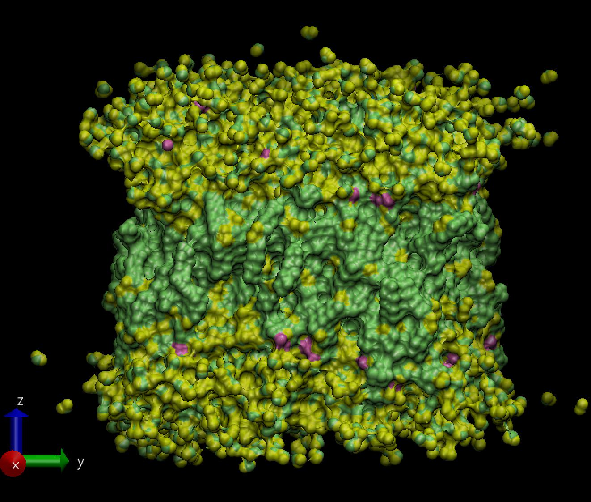
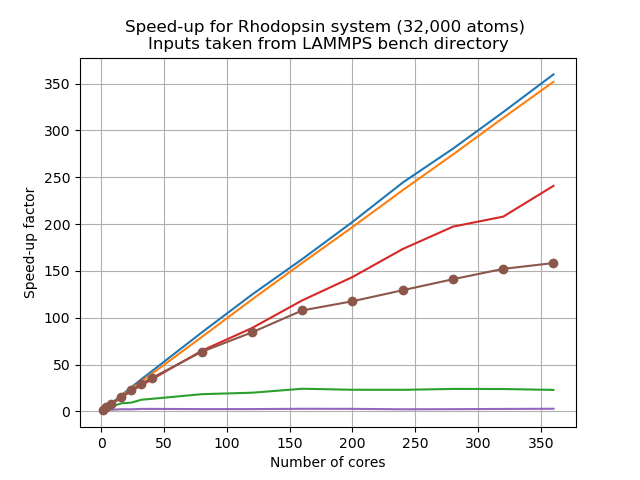

[Earlier]({{ page.root }}), you have
learnt the basic philosophies behind various parallel
computing methods (like MPI, OpenMP and CUDA). LAMMPS is a massively-parallel molecular
dynamics package that is
primarily designed with MPI-based *domain decomposition* as its main parallelization
strategy. It supports all of the other parallelization techniques through the use of
appropriate accelerator packages on the top of the intrinsic MPI-based parallelization.

So, is the only thing that needs to be done is decide on which accelerator package to
use? Before
using any accelerator package to speedup your runs, it is always wise to identify
performance *bottlenecks*. The term "bottleneck" refers to specific parts of an
application that are unable to
keep pace with the rest of the calculation, thus slowing overall performance.

Therefore, you need to ask yourself these questions:
* Are my runs slower than expected?
* What is it that is hindering us getting the expected scaling behaviour?

## Identify bottlenecks

Identifying (and addressing) performance bottlenecks is important as this could save you
a lot of
computation time and resources. The best way to do this is to start with a reasonably
representative system having a modest system size with run for a few hundred/thousand
of timesteps.

LAMMPS provides a timing breakdown table printed at the end of log file
and also within the screen output file generated at the end of each LAMMPS run. The
timing breakdown table has already been introduced in
[the previous episode]({{ page.root }})
but let's take a look at it again:

~~~
MPI task timing breakdown:
Section |  min time  |  avg time  |  max time  |%varavg| %total
---------------------------------------------------------------
Pair    | 1.5244     | 1.5244     | 1.5244     |   0.0 | 86.34
Neigh   | 0.19543    | 0.19543    | 0.19543    |   0.0 | 11.07
Comm    | 0.016556   | 0.016556   | 0.016556   |   0.0 |  0.94
Output  | 7.2241e-05 | 7.2241e-05 | 7.2241e-05 |   0.0 |  0.00
Modify  | 0.023852   | 0.023852   | 0.023852   |   0.0 |  1.35
Other   |            | 0.005199   |            |       |  0.29
~~~
{: .output}

Note that `%total` of the timing is giving for a range of different parts of the
calculation. In the following section, we will work on a few examples and try to
understand how to identify bottlenecks from this output.

The very first thing to do is run the simulation with just 1 MPI rank and no
threads and find a way to minimise the walltime by adjusting the balance between
`Pair`, `Neigh`, `Comm` and the other parts of the calculation.

To get a feeling for this process, let us start with a Lennard-Jones (LJ) system. We'll study
two systems: the first one is with 4,000 atoms only; and the other one would be quite
large, almost 10 million atoms. The following input file is for a LJ-system with an fcc
lattice:

~~~

~~~
{: .source}

We can vary the system size (i.e. number of atoms) by assigning appropriate
values to the variables `x`, `y`, and `z` at the beginning of the input file.
The length of the run can be decided by the
variable `t`. We'll choose two different system sizes here: the one given is tiny just
having 4000 atoms (`x = y = z = 10`, `t = 1000`). If we take this input and modify it
such that `x = y = z = 140` the other one would be huge
containing about 10 million atoms. We have chosen this purposefully and let us do a
*serial* run (i.e. on a single core), in our case this is with 1 MPI rank and without any
OpenMP threads. Now let us have a look at an example of the timing breakdown table.

> ## Example timing breakdown for 4000 atoms LJ-system
>
> ```
> MPI task timing breakdown:
> Section |  min time  |  avg time  |  max time  |%varavg| %total
> ---------------------------------------------------------------
> Pair    | 12.224     | 12.224     | 12.224     |   0.0 | 84.23
> Neigh   | 1.8541     | 1.8541     | 1.8541     |   0.0 | 12.78
> Comm    | 0.18617    | 0.18617    | 0.18617    |   0.0 |  1.28
> Output  | 7.4148e-05 | 7.4148e-05 | 7.4148e-05 |   0.0 |  0.00
> Modify  | 0.20477    | 0.20477    | 0.20477    |   0.0 |  1.41
> Other   |            | 0.04296    |            |       |  0.30
> ```
> {: .output}
>
> This is for the small
> system (having 4000 atoms). The last `%total` column in the table tells about the
> percentage of the total loop time is spent in this category. Note that most of the CPU
> time is spent on `Pair` part (~84%), about ~13% on the `Neigh` part and the rest of the
> things have taken only 3% of the total simulation time. So, in order to get a
> performance gain, the common choice would be to find a way to reduce the time taken
> by the `Pair` part since improvements there will have the greatest impact on the overall
> time. Often OpenMP or using a GPU can help us to achieve this, but not always! It very much
> depends on the system that you are studying (the pair styles you use in your calculation
> need to be supported).
{: .callout}

> ## Example timing breakdown for 10 million atoms LJ-system
>
> The following table shows an example timing breakdown for a large, 10 million atom system.
> Note that, though the absolute time to complete the simulation
> has increased significantly (it now takes about 1.5 hours), the distribution of
> `%total` remains the same.
>
> ```
> MPI task timing breakdown:
> Section |  min time  |  avg time  |  max time  |%varavg| %total
> ---------------------------------------------------------------
> Pair    | 7070.1     | 7070.1     | 7070.1     |   0.0 | 85.68
> Neigh   | 930.54     | 930.54     | 930.54     |   0.0 | 11.28
> Comm    | 37.656     | 37.656     | 37.656     |   0.0 |  0.46
> Output  | 0.1237     | 0.1237     | 0.1237     |   0.0 |  0.00
> Modify  | 168.98     | 168.98     | 168.98     |   0.0 |  2.05
> Other   |            | 43.95      |            |       |  0.53
> ```
> {: .output}
{: .callout}

> ## Executing on a node
>
> Make a copy of the example input modified to run the large system (`x = y = z = 140`).
>
> Now run the two systems using all the cores available in a single node and then run
> with more nodes (2, 4) with full capacity and note how this timing breakdown varies rapidly.
> While running with multiple cores, we're using only MPI only as parallelization method.
> Below we have shown the table for the small system when run with 40 MPI ranks.
>
> You can use the job scripts from
> [the previous episode]({{ page.root }})
> as a starting point.
>
{: .challenge}

> ## Important!
>
> For many of these exercises, the exact modifications you will need to implement are system
> specific. Check with your instructor or your HPC institution's helpdesk for information specific
> to your HPC system.
{: .callout}

> ## Example timing breakdown for 4000 atoms LJ-system with 40 MPI ranks
>
> ~~~
> MPI task timing breakdown:
> Section |  min time  |  avg time  |  max time  |%varavg| %total
> ---------------------------------------------------------------
> Pair    | 0.24445    | 0.25868    | 0.27154    |   1.2 | 52.44
> Neigh   | 0.045376   | 0.046512   | 0.048671   |   0.3 |  9.43
> Comm    | 0.16342    | 0.17854    | 0.19398    |   1.6 | 36.20
> Output  | 0.0001415  | 0.00015538 | 0.00032134 |   0.0 |  0.03
> Modify  | 0.0053594  | 0.0055818  | 0.0058588  |   0.1 |  1.13
> Other   |            | 0.003803   |            |       |  0.77
> ~~~
> {: .output}
>
{: .callout}


> ## Analysing the small system
>
> Below is an example timing breakdown for 4000 atoms LJ-system with 40 MPI ranks
>
> ~~~
> MPI task timing breakdown:
> Section |  min time  |  avg time  |  max time  |%varavg| %total
> ---------------------------------------------------------------
> Pair    | 0.24445    | 0.25868    | 0.27154    |   1.2 | 52.44
> Neigh   | 0.045376   | 0.046512   | 0.048671   |   0.3 |  9.43
> Comm    | 0.16342    | 0.17854    | 0.19398    |   1.6 | 36.20
> Output  | 0.0001415  | 0.00015538 | 0.00032134 |   0.0 |  0.03
> Modify  | 0.0053594  | 0.0055818  | 0.0058588  |   0.1 |  1.13
> Other   |            | 0.003803   |            |       |  0.77
> ~~~
> {: .output}
>
> Can you discuss any observations that you can make from the above table? What could
> be the rationale behind such a change of the `%total` distribution among various
> categories?
>
> > ## Solution
> >
> > The first thing that we notice in this table is that when we use 40 MPI processes
> > instead of 1 process, percentage contribution of the `Pair` part to the total
> > looptime has come down to about ~52% from 84%, similarly for the `Neigh` part also
> > the percentage contribution reduced considerably. The striking feature is that the
> > `Comm` is now taking considerable part of the total looptime. It has increased from
> > ~1% to nearly 36%. But why?
> >
> > We have 4000 total atoms. When we run this with 1 core, this handles calculations
> > (i.e. calculating pair terms, building neighbour list etc.) for all 4000 atoms. Now
> > when you run this with 40 MPI processes, the particles will be distributed among
> > these 40 cores "ideally" equally (if there is no *load imbalance* (see below)). These cores then do
> > the calculations in parallel, sharing information when necessary. This leads to the
> > speedup. But this comes at a cost of communication between these MPI processes. So,
> > communication becomes a bottleneck for such systems where you have a small number of
> > atoms to handle and many workers to do the job. This implies that you really don't
> > need to waste your resource for such a small system.
> {: .solution}
{: .discussion}

> ## Load balancing
>
> One important issue with MPI-based
> parallelization is that it can under-perform for systems with inhomogeneous
> distribution of particles, or systems having lots of empty space in them. It is pretty
> common that the evolution of simulated systems evolve over time to reflect such a case.
> This results in *load imbalance*. While some of the processors are assigned with
> finite number of
> particles to deal with for such systems, a few processors could have far less atoms (or
> none) to do any calculation and this results in an overall loss in parallel efficiency.
> This situation is more likely to expose itself as you scale up to a large
> large number of processors.
>
> You can deal with load imbalance up to a certain extent using `processors` and `balance`
> commands in LAMMPS. Detail usage is given in the 
> (source:[LAMMPS manual](https://lammps.sandia.gov/doc/Manual.html)).
{: .callout}

> ## Analysing the large system
>
> Now consider the following breakdown table for 1 million atom system with 40
> MPI-processes. You can see that in this case, still `Pair` term is dominating the
> table. Discuss about the rationale behind this.
> ~~~
> MPI task timing breakdown:
> Section |  min time  |  avg time  |  max time  |%varavg| %total
> ---------------------------------------------------------------
> Pair    | 989.3      | 1039.3     | 1056.7     |  55.6 | 79.56
> Neigh   | 124.72     | 127.75     | 131.11     |  10.4 |  9.78
> Comm    | 47.511     | 67.997     | 126.7      | 243.1 |  5.21
> Output  | 0.0059468  | 0.015483   | 0.02799    |   6.9 |  0.00
> Modify  | 52.619     | 59.173     | 61.577     |  25.0 |  4.53
> Other   |            | 12.03      |            |       |  0.92
> ~~~
> {: .output}
>
> > ## Solution
> >
> > In this case, the system size is enormous. Each core will have enough atoms to deal
> > with so it remains busy in computing and the time taken for the communication is
> > still much smaller as compared to the "real" calculation time. In such cases, using
> > many cores is actually beneficial.
> >
> > One more thing to note here is the second last
> > column `%varavg`. This is the percentage by which the max or min varies from the
> > average value. A value near to zero implies perfect *load balance*, while a large
> > value indicated load imbalance. So, in this case, there is a considerable amount of
> > load imbalance specially for the `Comm` and `Pair` part. To improve the performance,
> > one may like to explore a way to minimize load imbalance (but unfortunately we won't
> > have time to cover this topic).
> >
> {: .solution}
{: .discussion}

Let us now work on another example from LAMMPS `bench` directory with the input file
below. Let's run it using
1 core (i.e., in *serial*) with `x = y = z = 1`, and `t = 10,000`.
~~~

~~~
{: .source}

> ## Example timing breakdown for system with low average number of neighbours
>
> ~~~
> Section |  min time  |  avg time  |  max time  |%varavg| %total
> ---------------------------------------------------------------
> Pair    | 20.665     | 20.665     | 20.665     |   0.0 | 18.24
> Bond    | 6.9126     | 6.9126     | 6.9126     |   0.0 |  6.10
> Neigh   | 57.247     | 57.247     | 57.247     |   0.0 | 50.54
> Comm    | 4.3267     | 4.3267     | 4.3267     |   0.0 |  3.82
> Output  | 0.000103   | 0.000103   | 0.000103   |   0.0 |  0.00
> Modify  | 22.278     | 22.278     | 22.278     |   0.0 | 19.67
> Other   |            | 1.838      |            |       |  1.62
> ~~~
> {: .output}
>
> Note that, in this case,
> the time spent in solving the `Pair` part is quite low as compared to the `Neigh`
> part. What do you think may have caused such an outcome?
>
> > ## Solution
> > This kind of timing breakdown generally indicates either there is something wrong
> > with the input or a very, very unusual system geometry. If you investigate the
> > screen or log file carefully, you would find that this is a system with a very
> > short cutoff (1.12 sigma) resulting in on average less than 5 neighbors per atoms
> > (`Ave neighs/atom = 4.85891`) and thus spending very little time on computing
> > non-bonded forces.
> >
> > Being a sparse system, the necessity of rebuilding its neighbour
> > lists is more frequent and this explains why the time spent of the `Neigh` part is
> > much more (about 50%) than the `Pair` part (~18%). On the contrary, the LJ-system
> > is the extreme opposite. It is a relatively dense system having the average number
> > of neighbours per atom nearly 37 (`Ave neighs/atom = 37.4618`). More computing
> > operations are needed to decide the pair forces per atom (~84%), and less frequent
> > would be the need to rebuild the neighbour list (~10%).  So, here your system
> > geometry is the bottleneck that causes the neighbour list building to happen too
> > frequently and taking a significant part of the entire simulation time.
> {: .solution}
{: .discussion}

## MPI vs OpenMP

By now you should have developed some understanding on how can you use the timing
breakdown table to identify performance bottlenecks in a LAMMPS run. But identifying
the bottleneck is not enough, you need to decide what strategy would 'probably' be more
sensible to apply in order to unblock the bottlenecks. The usual method of speeding
up a calculation is to employ some form of *parallelization*. We have already discussed in
[a previous episode]({{ page.root }})
that there are many ways to implement parallelism in a
code.

MPI based parallelism using domain decomposition lies at the core of LAMMPS. Atoms
in each domain are associated to 1 MPI task. This domain decomposition approach comes
with a cost however, keeping track and coordinating things among these domains requires
communication overhead. It could lead to significant drop in performance if you have
limited communication bandwidth, load imbalance in your simulation, or if you wish
to scale to a very large number of cores.

While MPI offers domain based parallelization, one can also use parallelization over
particles. This can, for example, be done using OpenMP which is a different parallelization
paradigm based on threading. This multi-threading is *conceptually* easy to implement.
Moreover, OpenMP parallelization is orthogonal to MPI parallelization which means you can
use them together. OpenMP also comes with an overhead: starting and stopping OpenMP takes
compute time; OpenMP also needs to be careful about how it handles memory (which can be
expensive depending on the implementation), the particular use case impacts the
efficiency. Remember that, in general, a threaded parallelization method in LAMMPS
may not be as efficient as MPI unless you have situations where domain decomposition
is no longer efficient (we will see below how to recognise such situations).

Let us discuss a few situations:

  1. **The LJ-system with 4000 atoms (discussed above)**: Communication bandwidth with more
     MPI processes. When you have too few atoms per domain, at some point LAMMPS will
     not scale, and may even run slower, if you use more processors via
     MPI only. With a pair style like `lj/cut` this will happen at a rather small number
     of atoms.
  2. **The LJ-system with with 10M atoms (discussed above)**: More atoms per processor,
     still communication is not a big deal in this case. This happens because you have
     a dense, homogeneous, well behaved system with a sufficient number of atoms, so
     that the MPI parallelization can be at its most efficient.
  3. **Inhomogeneous or slab systems**: In systems where there could be lots of empty spaces
     in the simulation cell, the number of atoms handled across these domains will vary
     a lot resulting in severe load balancing issue. While some of the domains will be
     over-subscribed, some of them will remain under-subscribed causing these domains
     (cores) to be less efficient in terms of performance. Often this could be improved by
     using the `processor` keyword in a smart fashion, beyond that, there are the load
     balancing commands (`balance` command) and changing the communication using
     recursive bisecting and decomposition strategy. This might not help always since
     some of the systems are pathological. In such cases, a combination of MPI and
     OpenMP could often provide better parallel efficiency as this will result in
     larger subdomains for the same number of total processors and if you parallelize
     over particles using OpenMP threads, generally it does not hamper load balancing
     in a significant way. So, a sensible mix of MPI, OpenMP and the `balance` command
     can help you to fetch better performance from the same hardware.
  4. **MD problems**: For these, we need to deal with the calculation of electrostatic
     interactions. Unlike the pair forces, electrostatic interactions are long range by
     nature. To compute this long range interactions, very popular methods in MD are
     `ewald` and `pppm`. These long range solvers perform their computations in
     K-space. In case of `pppm`, extra overhead results from the 3d-FFT, where as the
     Ewald method suffers from the poor $$O(N^\frac{3}{2})$$ scaling, which will drag down the
     overall performance when you use more cores to do your calculation, even though
     Pair exhibits linear scaling. This is also a potential case where a hybrid
     run comprising of MPI and  OpenMP might give you better performance and improve
     the scaling.

Let us now build some hands-on experience to develop some feeling on how this works.

### Situation practice: Rhodopsin system

The input file (given below) is prepared following the inputs provided in the *bench*
directory of the LAMMPS distribution (version `7Aug2019`):

~~~

~~~
{: .source}

Using this you can perform a simulation
of an all-atom rhodopsin protein in solvated lipid bilayer with CHARMM force field,
long-range Coulombics interaction via PPPM (particle-particle particle mesh) and
SHAKE constraints. The box contains counter-ions and a reduced amount of water to make
a 32000 atom system. The force cutoff for LJ force-field is 10.0 Angstroms, neighbor
skin cutoff is 1.0 sigma, number of neighbors per atom is 440. NPT time integration
is performed for 20,000 timesteps.

<p align="center"></p>

To submit this as a job using 4 processors, we can modify our previous job script:

```

```
{: .bash}

replacing the input file `in.lj` with the input file for the new system.

> ## Investigating speedup
> 
> 1. Using the `log.lammps` files you have created in the previous exercises, write down the
>    speedup factor for the `Pair`, `Comm` and `walltime` fields in the timing breakdowns. Use
>    the below formula to calculate speedup.
> 
>    ```
>    (Speedup factor) = 1.0 / ( (Time taken by n processors) / (Time taken by 1 processor) )
>    ```
>
> 2. Using a simple pen and paper, make a plot of speedup factor on the y-axis and number of
>    processors on the x-axis.
>
> 3. What are your observations about this plot? Which fields show a good speedup factor?
>    Discuss what could be a good approach in fixing this.
>
> > ## Solution
> > You should have noticed that `Pair` shows almost perfect linear scaling, whereas `Comm` shows
> > poor scalability. and the total walltime also suffers from the poor scalability when running
> > with more number of cores.
> > 
> > However this is a very small sample size, as to get a better speedup, more nodes and cores need
> > to be utilised. Take the example below of an effective scalability study.
> > 
> > This was carried out on an Intel Skylake processor which has 2 sockets and 20 cores each,
> > meaning 40 physical cores per node. Here jobs were run with 1, 4, 8, 16, 32, 40 processors, and
> > then scaled up to 80, 120, 160, 200, 240, 280, 320, 360, 400 cores. You can go further,
> > depending on your system and availability.
> > 
> > <p align="center"></p>
> >
> > 
> > As we can see, similar to your own example, `Pair` and `Bond` show almost perfect linear
> > scaling, whereas `Kspace` and `Comm` show poor scalability, and the total walltime also
> > suffers from the poor scalability when running with more number of cores. This resembles
> > situation 4 discussed above. A mix of MPI and OpenMP could be a sensible approach.
> {: .solution}
{: .challenge}