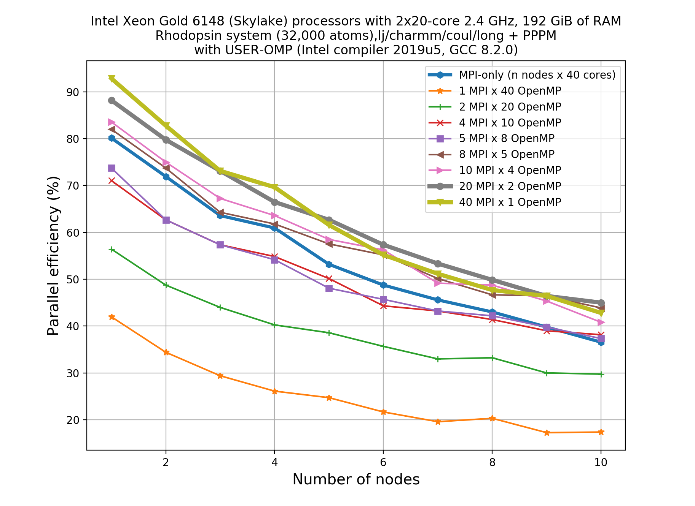
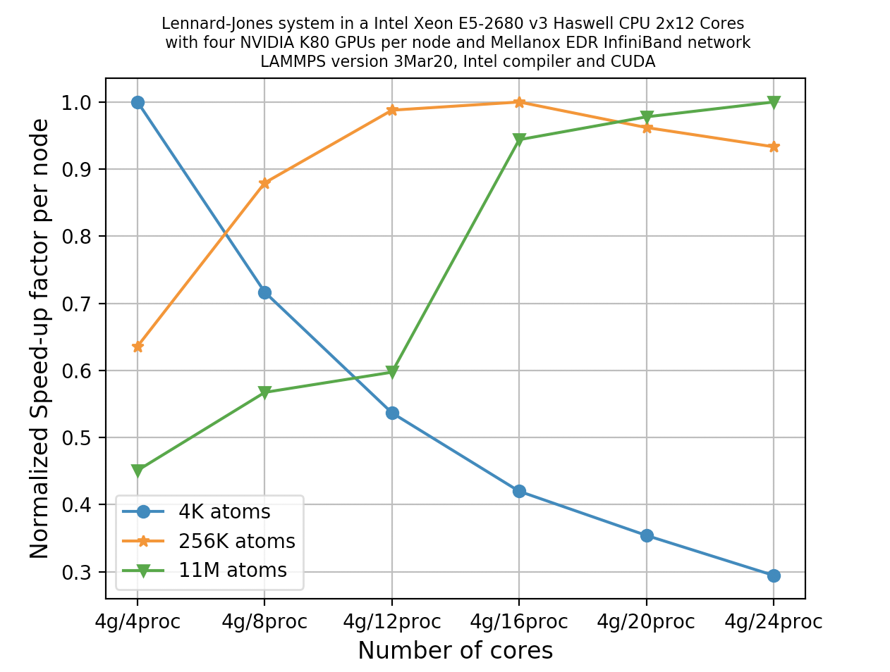
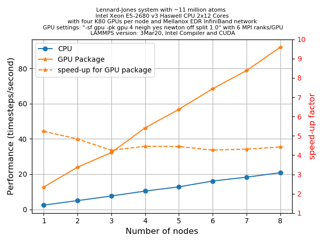

## How can I accelerate LAMMPS performance?

There are two basic approaches to speed LAMMPS up. One is to use better algorithms for certain
types of calculation, and the other is to use highly optimized codes via various "accelerator
packages" for hardware specific platforms.

One popular example of the first approach is to use the Wolf summation method instead of the Ewald
summation method for calculating long range Coulomb interactions effectively using a short-range
potential. Similarly there are a few FFT schemes offered by LAMMPS and a user has to make a
trade-off between accuracy and performance depending on their computational needs. This lesson is
not aimed to discuss such types of algorithm-based speed-up of LAMMPS, instead we'll focus on a few
accelerator packages that is used to extract the most out of the available hardware of a HPC system.

There are five accelerator packages currently offered by LAMMPS. These are;

1. **OPT**
2. **USER-INTEL**
3. **USER-OMP**
4. **GPU**
5. **Kokkos**

Specialized codes contained in these packages help LAMMPS to perform well on the
spectrum of architectures found in modern HPC platforms. Therefore, the very next
question that arises is: what hardware is supported by these packages?

> ## Supported hardware
>
> | Hardware        | Accelerators                      |
> | --------------- | --------------------------------- |
> | Multi-core CPUs | OPT, USER-INTEL, USER-OMP, Kokkos |
> | Intel Xeon Phi  | USER-INTEL, Kokkos                |
> | NVIDIA GPU      | GPU, Kokkos                       |
>
{: .callout}

Within the limited scope of this tutorial, it is almost impossible to discuss all of the above
packages in detail. The key point to understand is that, in all cases, the
acceleration packages use multi-threading for parallelization, but how they do it and
what architecture they can address differ.

The **ONLY** accelerator package that supports all
kinds of hardware is **Kokkos**. Kokkos is a templated C++ library developed in Sandia National
Laboratory and this helps to create an abstraction that allows a *single implementation* of a
software application on different kinds of hardware. This will be discussed in detail in the
[next lesson]({{page.root}}/06-invoking-kokkos).

In the meantime, we'll touch a few key points about other accelerator packages to give you a feel
about what these packages offer. To do this we will learn:
* how to invoke an accelerator package in a LAMMPS run
* gather data to compare the speedup with other LAMMPS runs.

## Accelerator package overview

### **OPT** package

* Only a handful of pair styles can be accelerated using this package (the list can be found
  [here]({{page.root}}/reference/#package-OPT)).
* Acceleration, in this case, is achieved by using a templated C++ library to reduce computational
  overheads due to `if` tests and other conditional code blocks.
* This also provides better vectorization operations as compared to its regular CPU version.
* This generally offers 5-20% savings on computational cost on most machines

> ## Effect on the timing breakdown table
>
> We have discussed earlier that at the end of each run LAMMPS prints a timing breakdown table
> where it categorises the spent time into several categories (like `Pair`, `Bond`, `Kspace`,
> `Neigh`, `Comm`, `Output`, `Modify`, `Other`). Can you make a justified guess about which of
> these category could be affected by the use of the **OPT** package?
> >
> > ## Solution
> >
> > The `Pair` component will see a reduction in cost since this accelerator package aims to work
> > on the pair styles only.
> {: .solution}
{: .discussion}

### **USER-INTEL** package

The **USER-INTEL** package supports *single*, *double* and *mixed* precision calculations.

Acceleration, in this case, is achieved in two different ways:

* Use vectorisation on multi-core CPUs
* Offload calculations of neighbour list and non-bonded interactions to Phi co-processors.

There are, however, a number of conditions:

* For using the offload feature, the Intel Xeon Phi coprocessors are required.
* For using vectorization feature, Intel compiler with version 14.0.1.106 or versions 15.0.2.044
  and higher is required on both multi-core CPUs and Phi systems.

There are many LAMMPS features that are supported by this accelerator package, the list can be
found [here]({{page.root}}/reference/#package-USER-INTEL).

Performance enhancement using this package depends on many considerations, such as the
hardware that is available to you, the various styles that you are using in the input,
the size of your problem, and the selected precision. For example, if you are using a
pair style (say, `reax`) for which this is not implemented, its obvious that you are not
going to have a performance gain for the `Pair` part of the calculation. If the
majority of the computation time is coming from the `Pair` part then you are in trouble.
If you would like to know how much speedup you can expect to achieve using USER-INTEL, you can
take a look in the
[corresponding LAMMPS documentation](https://lammps.sandia.gov/doc/Speed_intel.html)

> ## Single, double, mixed precision calculations
>
> ***NEED TO EXPLAIN WHAT THIS MEANS IN CALLOUT*** Explain me!
{: .callout}

### **USER-OMP** package

This accelerator package offers performance gain through optimisation and multi-threading
via the OpenMP interface. In order to make the multi-threading functional, you will need
multi-core CPUs and a compiler that supports multi-threading. If your compiler does not
support multi-threading then also you can still use it as an optimized serial code.

A large sub-set of the LAMMPS routines can be used with this accelerator. A list of
functionalities enabled with this package can be found
[here]({{page.root}}/reference/#package-USER-OMP).

Generally, one can expect 5-20% performance boost when using this package either in serial.
You should always test to figure out what the optimal number of OpenMP threads
to use for a particular simulation is. Generally, the package gives better performance
when used for lower numbers of threads, for example 2-4. It is important to remember
that the MPI implementation in LAMMPS is so robust that you may almost always expect this
to be more effective than using OpenMP on multi-core CPUs.

### **GPU** package

Using the **GPU** package in LAMMPS, one can achieve performance gain by coupling GPUs to
one or many CPUS. Since supports both CUDA (which is vendor specific) and OpenCL (which
is an open standard), it can be used on a variety of GPU hardware.

Calculations that require access to atomic data like coordinates, velocities, forces may suffer
bottlenecks since at every step these data are communicated back and forth between the
CPUs and GPUs. Calculations can be done in single, double or mixed precisions.

In case of the **GPU** package, computations are shared between CPU and GPU
(unlike the Kokkos package GPU implementation where the primary aim is to offload all of
the calculations to the GPUs only). For example,
asynchronous force calculations like **pair** vs **bond/angle/dihedral/improper** can be done
simultaneously on GPUs and CPUs respectively. Similarly, for PPPM calculations the charge
assignment and the force computations are done on GPUs whereas the FFT calculations that
require MPI communications are done on CPUs. Neighbour lists can be built on either
CPUs or GPUs. You can control this using specific flags in the command line of your job
submission script. Thus the GPU package can provide a balanced mix of GPU and CPU usage for a
particular simulation to achieve a performance gain.

A list of functionalities enabled with this package can be found
[here]({{page.root}}/reference/#package-GPU).

### **Kokkos** package

The Kokkos package in LAMMPS is implemented to gain performance with portability. This will be
discussed in more depth in the next lesson (**FIXME ADD LINK**)

## How to invoke a package in LAMMPS run?

Let us now come back to the *Rhodopsin* example for which we did a thorough scaling
study in the previous episode. We found that the `Kspace` and `Neigh` calculations
suffer from poor scalability as you increase number of cores to do the calculations. In
such situation a hybrid approach combining parallelizing over domains (i.e. MPI-based)
and parallelizing over atoms (i.e. thread-based OpenMP) could be more beneficial to
improve scalability than a pure MPI-based approach. To test this, in the following
exercise, we'll do a set of calculations to mix MPI and OpenMP using the **USER-OMP**
package. Additionally, this exercise will also help us to learn the basic principles of
invoking accelerator packages in a LAMMPS run. Before starting our runs, let us now
discuss the syntax of the `package` command in LAMMPS, as outlined below.

To call an accelerator package (**USER-INTEL**, **USER-OMP**, **GPU**, **Kokkos**) in
your LAMMPS run, you need to know a LAMMPS command called `package`. This command
invokes package-specific settings for an accelerator. You can learn about this command
in detail from the
[LAMMPS manual](https://lammps.sandia.gov/doc/package.html).

The basic syntax for the additional options to the LAMMPS are:
```
package <style> <arguments>
```

`style` allows you to choose the accelerator package for your run. There are four different
packages available currently (version 3Mar20):

* `intel`: This calls the **USER-INTEL** package
* `omp` : This calls the **USER-OMP** package
* `gpu`: This calls the **GPU** package
* `kokkos`: This calls the **Kokkos** package

## How to invoke the **USER-OMP** package

To call **USER-OMP** in a LAMMPS run, use `omp` as `style`. Next you need to choose
proper `<arguments>` for the `omp` style. `<arguments>` should be chosen as the number
of OpenMP threads that you like to associate with each MPI process. This is an integer
and should be chosen sensibly. If you have N number of physical cores available per node
then
```
(Number of MPI processes) x (Number of OpenMP threads) = (Number of cores per node)
```
`<arguments>` can potentially include a number of *keywords* and their corresponding *values*.
These *keyword/values* provides with you enhanced flexibility to distribute your job among
the MPI ranks and threads. For a quick reference, the following table could be useful:

|Keyword   | values  | What it does? |
|----------|---------|---------------|
| neigh    | yes     | threaded neighbor list build (this is the default) |
| neigh    | no      | non-threaded neighbor list build |

There are two alternate ways to add these options to your simulation:

* Edit the input file and introduce the line describing the `package` command in it. This
  is perfectly fine, but always remember to use this near the top of the script, before
  the simulation box has been defined. This is because it specifies settings that the
  accelerator packages use in their initialization, before a simulation is defined.

  An example of calling the *USER-OMP* package in a LAMMPS input file is given below:
  ```
  package omp 4 neigh no
  ```
  {: .code}

  To distinguish the various styles of these accelerator packages from
  its 'regular' non-accelerated variants, LAMMPS has introduced *suffixes* for styles
  that map to `package` names.
  When using input files, you also need to append an extra `/omp` *suffix* wherever
  applicable to indicate the accelerator package is used for a style. For
  example, if we take a pair potential that would normally be set with
  `lj/charmm/coul/long`, when using **USER-OMP** optimization it would be set in the input
  file as:
  ```
  pair_style      lj/charmm/coul/long/omp 8.0 10.0
  ```
  {: .code}

* A simpler way to do this is through the command-line when launching LAMMPS using the
  `-pk` command-line switch. The syntax would be essentially the same as when used in an
  input script:
  ```
   mpirun -np 10 -ppn 10 lmp -in in.rhodo -sf omp -pk omp 4 neigh no
  ```
  {: .bash}
  The second method appears to be convenient since you don't need to take the hassle to
  edit the input file (and possibly in many places)!

  Note that there is an extra command-line switch in the above command-line. Can you
  imagine this is for? The `-sf`
  switch auto-appends the provided accelerator suffix to various styles in the input script.
  Therefore, when an accelerator package is invoked through the `-pk` switch (for
  example, `-pk omp` or `-pk gpu`), the `-sf` switch ensures that the appropriate style
  is also being invoked in the simulation (for example, it ensures that the `lj/cut/gpu`
  is used instead of `lj/cut` as `pair_style`, or,  `lj/charmm/coul/long/omp` is used
  in place of `lj/charmm/coul/long`).

In this tutorial, we'll stick to the second method of invoking the accelerator package,
i.e. through the command-line.

> ## Case study: Rhodopsin (with **USER-OMP** package)
>
> We shall use the same input file for the rhodopsin system with lipid bilayer (**FIXME LINK**). The
> settings for this run are described in a
> [previous episode]({{page.root}}/04-lammps-bottlenecks/#situation-practice-rhodopsin-system).
> In this episode, we'll run this using the **USER-OMP** package to mix MPI and OpenMP. For
> all the runs we will use the default value for the *neigh* keyword.
>
> 1. First, find out the number of cpu cores available per node in the HPC system that
>    you are using and then figure out all the possible MPI/OpenMP combinations that you
>    can have per node. For example on a node with 40 physical cores, there are 8 combinations per
>    node. Write down the different combinations for your machine, then choose one to run. Then run
>    the code again with pure MPI settings, without **any** OpenMP threading, to avoid any overhead.
>    Do you notice a difference in speedup?
>
>    ```
>    (Number of MPI processes) x (Number of OpenMP threads) = (Number of cores per node)
>    ```
>
> 2. On a system of a node with 40 cores, if we want to see scaling, say up to 10 nodes, this means
>    that a total of 80 calculations would need to be run since we have 8 MPI/OpenMP combinations
>    for each node. Thankfully, you don’t need to do the 80 calculations. A good metric to
>    measure strong scalability is to compute the parallel efficiency for each of these runs, where;
>
>    ```
>    Parallel efficiency = (Time taken by a serial run / (Np * (Time taken by Np cores))
>    ```
>
>    Using the `log.lammps` files here (**FIXME WITH LINK**), calculate the parallel efficiencies
>    to complete the csv (**FIXME WITH LINK**) file.  To get the total time taken by each job,
>    search for `wall time` in the log/screen output files. The value for the serial run can be taken
>    as `7019`. **NOTE: This will differ between systems. If time permits, find out the time taken**
>    **for a serial run on your system.**
>
> 3. Now that you have completed the csv, make a plot of parallel efficiency versus number of nodes
>    from the various combinations by running the python script (**FIXME WITH LINK**).
>
> 4. Write down your observations based on this plot and make comments on any performance
>    enhancement when you compare these results with the pure MPI runs.
>
> > ## Solution
> >
> > For a system with 40 cores per node, the following combinations are possible:
> > 
> > * 1 MPI task with 40 OpenMP threads
> > * 2 MPI tasks with 20 OpenMP threads
> > * 4 MPI tasks with 10 OpenMP threads
> > * 5 MPI tasks with 8 OpenMP threads
> > * 8 MPI tasks with 5 OpenMP threads
> > * 10 MPI tasks with 4 OpenMP threads
> > * 20 MPI tasks with 2 OpenMP threads
> > * 40 MPI tasks with 1 OpenMP threads (in this case, it is better not to use OMP at all)
> > 
> > For a perfectly scalable system, parallel efficiency should be equal to 100%, and
> > as it approaches zero we say that the parallel performance is poor.
> > 
> > Upon completing the exercise, you should have produced a plot similar to this, from which we
> > can take a few observations.
> >
> > <p align="center"></p>
> >
> > 1. As we increase number of nodes, the parallel efficiency decreases considerably
> >    for all the runs. This decrease in performance could be associated to the poor
> >    scalability of the `Kspace` and `Neigh` computations. We have discussed about
> >    this in episode 2.
> > 2. Parallel efficiency is increased by about 10-15% when we use mixed MPI+OpenMP
> >    approach.
> > 3. The performance of hybrid runs are better than or comparable to pure MPI runs
> >    only when the number of OpenMP threads are less than or equals to five. This
> >    implies that USER-OMP package shows scalability only when number of threads are
> >    less in number.
> > 4. Though we are seeing about 10-15% increase in parallel efficiency of hybrid
> >    MPI+OpenMP runs (using 2 threads) over pure MPI runs, still it is important to
> >    note that trends in loss of performance with increasing core number is similar
> >    in both of these types of runs thus indicating that this increase in performance
> >    might not be due to threading but rather due to better SIMD vectorization.
> >    Specially, for Skylake processor the vectorization capability is great. In fact,
> >    in LAMMPS, MPI-based parallelization almost always win over OpenMP until
> >    thousands of MPI ranks are being used where communication overheads very much
> >    significant. There are overheads to making the kernels thread-safe.
> {: .solution}
{: .challenge}

## How to invoke the **GPU** package

A question that you may be asking is how much speed-up would you expect from the GPU package.
Unfortunately there is no easy answer for this. This can depend on many things starting from
the hardware specification to the complexities involved with a specific problem that you are
simulating. However, for a given problem one can always optimize the run-time parameters to
extract the most out of a hardware. In the following section, we'll discuss some of these
tuning parameters for the simplest LJ-systems.

The primary aim for this following exercise is:

* To get a primary understanding of the various command line arguments that can control how a job is
  distributed among cpus/gpus, how to control cpu/gpu communications, etc.
* To get an initial idea on how to play with different run-time parameters to get an optimum
  performance.
* Finally, one can also make a fair comparison of performance between a *regular* LAMMPS run, the
  GPU package and (in the next episode) a Kokkos implementation of GPU functionality.
* Moreover, this exercise will also help the users to extend the knowledge of using the *package*
  command so that they can figure out by themselves how to use other accelerator packages in LAMMPS.

Before invoking the GPU package, you must ask the following questions:

 1. Do I have an access to a computing node having a GPU?
 2. Is my LAMMPS binary built with GPU package?

If the answer to these two questions is a *yes* then we you can proceed to the following section.

### Basic syntax: arguments and keywords

As discussed above, you need to use the `package` command to invoke the **GPU** package.
To use the **GPU** package for an accelerator you need to select `gpu` as *style*. Next
you need to choose proper `<arguments>` for the `gpu` style. The main argument for the
`gpu` style is:
* `ngpu`: This sets the number of GPUs per node. There must be at least as many MPI
  tasks per node as GPUs. If there are more
  MPI tasks (per node) than GPUs, multiple MPI tasks will share each GPU (which may
  not be optimal).

In `<arguments>`, we can also have a number of *keywords* and their corresponding
*values*. These *keyword/values* provides you enhanced flexibility to distribute your
job among CPUs and GPUs in an optimum way. For a quick reference, the table below
could be useful.

> ## Keywords of the GPU package
> For more details, see the [official documentation](https://lammps.sandia.gov/doc/package.html)
> for LAMMPS.
>
> | Keywords   |Use                                                                                                           |Default value |
> |------------|--------------------------------------------------------------------------------------------------------------|--------------|
> |`neigh`     | specifies where neighbor lists for pair style computation will be built: GPU or CPU.                         | yes          |
> |`newton`    | sets the Newton flags for pairwise (not bonded) interactions to off or on. Only *off* value is supported with the GPU package currently (version 3Mar20)                                                                                           | off (only)          |
> |`binsize`   | sets the size of bins used to bin atoms in neighbor list builds performed on the GPU, if *neigh = yes* is set  | 0.0          |
> |`split`     | used for load balancing force calculations between CPU and GPU cores in GPU-enabled pair styles              |  1.0 (all on GPU), -1.0 (dynamic load balancing), 0 <split<1.0 (custom)            |
> |`gpuID`     | allows selection of which GPUs on each node will be used for a simulation                                    |              |
> |`tpa`       | sets the number of GPU thread per atom used to perform force calculations. It is used for fining tuning of performance. When you use large cutoffs or do a simulation with a small number of particles per GPU, you may increase the value of this keyword to see if it can improve performance. The number of threads per atom must be chosen as a power of 2 and cannot be greater than 32 (with current version 3Mar20).                                    | 1            |
> |`device`    | used to tune parameters optimized for a specific accelerator and platform when using OpenCL                  |              |
> |`blocksize` | allows you to tweak the number of threads used per thread block                                              | minimum = 32 |
>
{: .callout}

Not surprisingly, the syntax we use is similar to that of **USER-OMP** package:

```
{{ site.run_openmp }} {{ site.sched_lammps_exec }} -in in.lj -sf gpu -pk gpu 2 neigh yes newton off split 1.0
```
{: .bash}


> ## Learn to call the **GPU** package from command-line
>
> Employing the full computing workforce to solve your problem may not always be the most
> profitable. We need to tune this before starting any production run. Derive a command line to
> submit a LAMMPS job for the LJ system described by the following input file with the following
> conditions. What command/package keywords should we run so that neighbour list building and force
> computation are done entirely on the GPUs
> 
> * Set `x=y=z=60`, `t=500`
> * Use 2 GPUs and 24 MPI ranks
> * Neighbour built on CPUs
> * Dynamic load balancing between CPUs and GPUs dynamic load balancing between the CPUs and the
>   GPUs.
>
> 
> 
> ```
> {{ member }}
> ```
> {: .source}
> > ## Solution
> >
> > ```
> > lmp -v x 60 -v y 60 -v z 60 -v t 500 -sf gpu -pk gpu 2 neigh no newton off split -1.0
> > ```
> >
> > The breakdown of the command is as follows;
> >
> > * `-v x 60 -v y 60 -v z 60` - Setting system size
> > * `-v t 500` - Setting length of run
> > * `-pk gpu 2` - Setting **GPU** package and number of GPUs
> > * `-sf gpu` - **GPU** package related fix/pair styles
> > * `neigh no` - A `no` value of `neigh` keyword indicates neighbour list built in the CPUs
> > * `newton off` - **(FIXME - WHY?)**
> > * `split -1.0` - Dynamic load balancing option between CPUs and GPUs when value = `-1`
> > 
> > **NB:** It is important to fix the number of MPI ranks in your submission script, and request
> > the number of GPUs you wish to utilise. This will change depending on your system.
> >
> {: .solution}
{: .challenge}

### Know about the **GPU** package output

At this stage, once you complete a job successfully, it is time to look for a few things in the
LAMMPS output file. The first of these is to check that  LAMMPS is doing the things
that you asked for and the rest are to tell you about the performances.

It prints about the device information both in the screen-output and the log file. You would notice
something similar to;

```

```
{: .output}

The first thing that you should notice here is that it's using an *acceleration* for the
pair potential lj/cut
and for this purpose it is using two devices (`Device 0` and `Device 1`) and 12 MPI-processes per
device. That is what you asked for: 2 GPUs (```-pk gpu 2```) and
`{{ site.sched_comment }} {{ site.sched_flag_ntasks }}=24`. The number of tasks is shared equally by
each GPU. The detail about the graphics card is also printed, along
with the *numerical precision* used by the **GPU** package is also printed. In this case, it
is using *double precision*. Next it shows how many MPI-processes are spawned per GPU.

#### Accelerated version of pair-potential

This section of the output shows you that it is actually using the *accelerated* version of the
pair potential `lj/cut`. You can see that it is using `lj/cut/gpu` though in your input file you
mentioned this as `pair_style  lj/cut 2.5`. This is what happens when you use the `-sf gpu`
command-line switch. This automatically ensures that the correct accelerated version is called for
this run.
```

```
{: .output}

#### Performance section

The following screen-output tells you all about the performance. Some of these terms are already
discussed in the [previous episode]({{page.root}}/04-lammps-bottlenecks). When you the **GPU**
package you would see an extra block
of information known as `Device Time Info (average)`. This gives you a total breakdown saying how
the devices (GPUs) have been utilised to do various parts of the job.

```

```
{: .output}

You should now know how to submit a LAMMPS job that uses the **GPU** package as an accelerator.
This is
quite simple, though optimizing the run may not be that straight-forward. You can have numerous
possibilities of choosing the *argument* and the *keywords*. Not only that, the host CPU might have
multiple cores. More choices would arise from here.

For a rule of thumb, you must have at least same number of MPI processes as the number of GPUs
available to you. But often, using many MPI tasks per GPU gives you the better performance. As an
example, if you have 4 physical GPUs, you must initiate (at least) 4 MPI processes for this job.
But, assume that you have a CPU with 12 cores. This gives you flexibility to use at most
12 MPI processes and
the possible combinations are 4 GPUs with 4 CPUs, 4 GPUs with 8 CPUs and 4 GPUs with 12
CPUs. Though it may sound like that
4 GPUs with 12 CPUs will provide the maximum speed-up, that may not be the case! This
entirely depends on
the problem and also on other settings which can in general be controlled by the *keywords*
mentioned in the above table. Moreover, one may find that for a particular problem using 2 GPUs
instead of 4 GPUs may give better performance, and this is why it is advisable to figure
out the best possible set of run-time parameters by following a thorough optimization
before starting the production runs. This might save your lot of resource and time!

> ## Exercise: Offload entire neighbor build and force computation to GPUs
> As mentioned above, employing the full computing workforce to solve your problem may
> not always return the most profit. We need to tune this before starting any production
> run. In this exercise, we'll be using the above input file defining a LJ-system. Here
> we'll do three sets of run where each set will have different numbers of atoms in the
> box. Let the system sizes be defined by `x = y = z = 10`, `x = y = z = 40` and
> `x = y = z = 140`. This implies that these three systems will have 4000, 256,000 and
> nearly 11 million atoms in the box respectively. We can choose the length of the
> simulation also using `t = 5000`. For each case, run it for different numbers of
> GPU/MPI task combinations. For example, I ran these systems in a node having 4 K80
> NVIDIA GPUs and 24 physical cores. I choose to employ all 4 GPUs abut different number
> of MPI tasks. Since there are 4 GPUs, I must use at least 4 MPI ranks. So, I choose
> the following combinations: 4 GPUs/4 MPI tasks, 4 GPUs/8 MPI tasks,
> 4 GPUs/12 MPI tasks, 4 GPUs/16 MPI tasks, 4 GPUs/20 MPI tasks and 4 GPUs/24 MPI tasks.
> For this exercise, choose `package` keywords such that neighbor list building and
> force computations are done entirely on the GPUs. It can be done using
> ```
> -sf gpu -pk gpu 4 neigh yes newton off split 1.0
> ```
> where 4 GPUs are being used. After the runs are over, the performance data
> is extracted from the log/screen output files using the command
> ```
> grep "Performance:" log.lammps
> ```
> {: .bash}
> in units of `timestep/s`. Finally, plot a *normalized speed-up factor per node* versus
> GPU/MPI choices for each of these configurations and write down the main observations.
>
> > ## Solution
> > I did this study in a Intel Xeon E5-2680 v3 Haswell CPU node having 2x12 cores per
> > node and two NVIDIA K80 GPUs (which actually means four visible devices per node).
> > Six GPU/MPI combinations were tried for each characteristic system size. These are
> > 4 GPUs/4 MPI tasks, 4 GPUs/8 MPI tasks, 4 GPUs/12 MPI tasks, 4 GPUs/16 MPI tasks,
> > 4 GPUs/20 MPI tasks and 4 GPUs/24 MPI tasks. The final plot is shown below.
> >
> > <p align="center"></p>
> >
> > The main observations from the following plots are:
> > 1. For the system with 4000 atoms, increasing the number of MPI tasks actually
> >    degrades the overall performance.
> > 2. For the 256K system, we can notice an initial speed-up with increasing MPI task
> >    counts up to 4 MPI ranks per GPU, and then it starts declining again.
> > 3. For the largest 11M atom system, there is a sharp increase of speed-up up to 4
> >    MPI ranks per GPU, and then also a relatively slow but steady increase is seen
> >    with increasing MPI tasks per GPU (in this case, 6 MPI tasks per GPU).
> >
> > Possible explanation:
> > 1. For the smallest system, the number of atoms assigned to each GPU or MPI ranks is
> >    very low. The system size is so small that considering GPU acceleration is practically meaningless. In this case you are emplying far too many workers to complete a small job and therefore it is not surprising that the scaling deteriorates with increasing MPI tasks. In fact, you may try to use 1 GPU and a few MPI task to see if the performance increases in this case.
> > 2. Fix Me.
> {: .solution}
{: .challenge}

> ## Exercise: Switch on dynamic load balancing
>
> We discussed earlier that it can be done using the `split` keyword. Using this keyword a
> fixed fraction of particles is offloaded to the GPU while force calculation for the
> other particles occurs simultaneously on the CPU. When you set `split 1` you are
> offloading entire force computations to the GPUs (discussed in previous exercise). What
> fraction of particles would be offloaded to GPUs can be set explicitly by choosing a
> value ranging from `0` to `1`. When you set its value to  `-1`, you are switching on
> dynamic load balancing. This means that LAMMPS selects the split factor dynamically.
>
> Let us repeat the entire exercise as described in the
> [previous exercise](#exercise-offload-entire-neighbor-build-and-force-computation-to-gpus)
> but this time we'll use dynamic load balancing, i.e. in the command-line we'll use:
> ```
> -sf gpu -pk gpu 4 neigh yes newton off split -1.0
> ```
> Plot the data for *normalized speed-up factor per node* versus GPU/MPI choices for each
> of these configurations and discuss how it differs from the observations that you
> derived from the
> [previous exercise](#exercise-offload-entire-neighbor-build-and-force-computation-to-gpus).
>
> > ## Solution
> > (FIX ME) This needs to be done!
> >
> > <p align="center"></p>
> {: .solution}
{: .challenge}

> ## Exercise 4: Speed-up (CPU versus GPU)
> By now we have idea about some of the 'preferred' tuning parameters for a LJ-sytem. For
> the current exercise, let us take the system with ~11 million atoms, i.e.
> `x = y = z = 140` and `t = 500` and for this size of atoms, we know from ***ADD REF***
> that 4 GPUs/24 MPI tasks (i.e. 6 MPI tasks per GPU) gives the best performance. We
> wish to see how much acceleration a GPU package can provide if we offload the entire
> force computation and neighbour list building to the GPUs. This can be done using
> ```
> -sf gpu -pk gpu 4 neigh yes newton off split 1.0
> ```
> {: .bash}
> * Do a systematic study by running the job with different number of nodes both with
>   and without the **GPU** package. For example, if five nodes are available to you,
>   run this job using all the physical cores available with 1 node, 2 nodes, 3 nodes,
>   4 nodes and 5 nodes (2 sets: one with the **GPU** package enabled, and the other is
>   the regular MPI-based runs without any accelerator package).
> * Extract the performance data from the log/screen output files from each of these
>   runs. You can do this using the command
>   ```
>   grep "Performance:" log.lammps
>   ```
>   and note down the performance value in units if `timestep/s`.
> * Make a plot to compare the performance of the CPU runs (i.e. without any accelerator
>   package) and the GPU runs (i.e. with the GPU package enabled) with number of nodes.
> * Plot the speed-up factor (= GPU performance/CPU performance) versus the number of
>   nodes.
> * Discuss the main observations from these plots.
>
> > ## Solution
> > I ran these jobs in the Jureca HPC system with nodes having
> > Haswell CPU with 2x12 cores per node and two NVIDIA K80 GPUs (four visible devices)
> > per node. Two sets of runs (i.e. with and without the GPU package) were executed
> > with up to 8 nodes. Performance data was extracted from the log files in the unit of
> > `timesteps/second`, speed-up factors were calculated for each node and were plotted
> > as shown below.
> >
> > <p align="center"></p>
> >
> > We can see a reasonable acceleration when we use the GPU package for all the runs
> > consistently. The calculated speed-up factors show that we obtain maximum speed-up
> > (~5.2x) when we use 1 node, then it gradually decreases (for 2 nodes it is 5x) and
> > finally saturates to a value of ~4.25x when we run using 3 nodes or higher (up to 8
> > nodes is tested here). The slight decrease in speed-up with increasing number of
> > nodes could be related to the inter-node communications. But overall the GPU package
> > offers quite a fair amount of performance enhancement over the regular CPU version
> > of LAMMPS with MPI parallelization.
> {: .solution}
{: .challenge}
