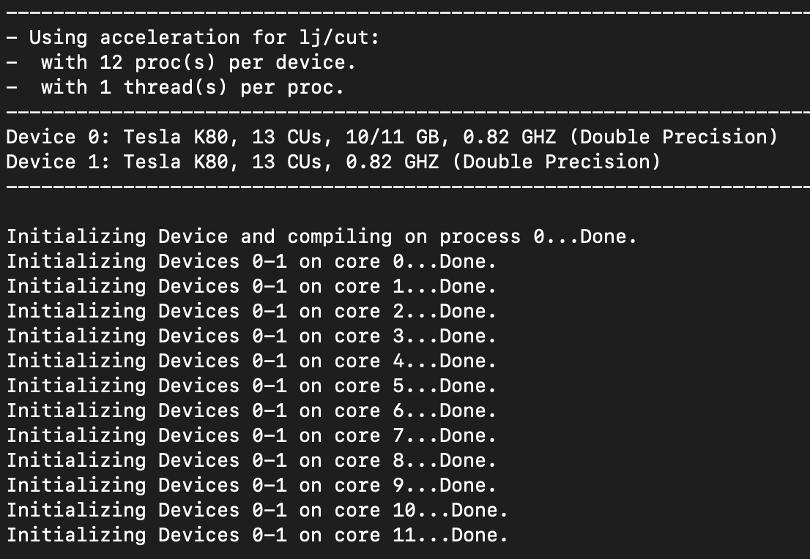
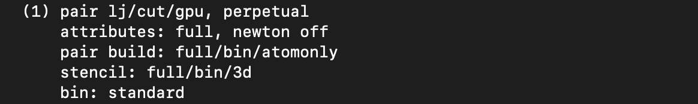
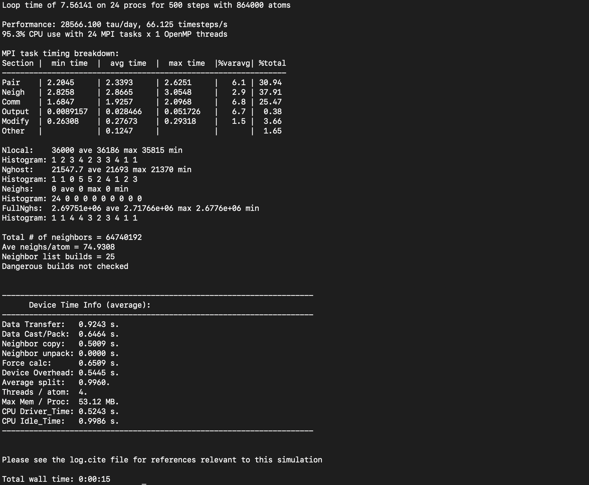

## How can I accelerate LAMMPS performance?
Well, there are two basic approaches to speed-up LAMMPS. One is to use better algorithm for certain types of calculation, and the other one is to use highly optimized codes via various "accelerator packages" deviced for hardware specific platforms. 

One popular example of first type of approach is to use the Wolf summation method instead of the Ewald summation method for calcultaing long range Coulomb interaction effectively using a short-range potential. Similarly there are a few FFT schemes are offered by LAMMPS and a user has to make a trade-off between accuracy and performance depending on his computational needs. The current tutorial is not aimed to discuss such types of algorithm based speed-up of LAMMPS rather we'll be discussing mainly on a few accelerator packages that is used to extract the most out of an available hardware of a HPC system.

There are five accelerator packages currently offered by LAMMPS. These are **OPT**, **USER-INTEL**, **USER-OMP**, **GPU** and **Kokkos**. Specialized codes contained in these packages help LAMMPS to perform well on modern HPC platforms which could have different hardware partitions. Therefore, the very next question that arises that what are these hardwares that are supported by these packages?

> ## Supported hardwares
>
> | Hardware | Accelarators |
> | -------- | ------------ |
> | Multi-core CPUs | OPT, USER-INTEL, USER-OMP, Kokkos |
> | Intel Xeon Phi | USER-INTEL, Kokkos |
> | NVIDIA GPU | GPU, Kokkos |
>
{: .callout}

Within the limited scope of this tutorial, this is almost impossible to discuss all of the above packages here. The key point to understand here is that the acceleration is achieved by multithreading either through OpenMP or GPU. The ONLY accelerator package that supports both kinds of hardwares is **Kokkos**. Kokkos is a templated C++ library developed in Sandia National Laboratory and this helps to create an abstraction that allows a *single implementation* of a software application on different kinds of hardwraes by simply mapping C++ kernel onto various backend languages. 

Before discussing on Kokkos, we'll touch a few key points about other accelerator packages to give you a feel about what these packages offer and in many cases these pakckages outperform Kokkos in its current form! 

> ## Kokkos: a developing library
>
> Most of the accelerator packages offered by LAMMPS may outperform Kokkos. Can you think of then why should we bother to learn using Kokkos?
{: .discussion}

> ## OPT package
>
> * Acceleration, in this case, is mainly achieved by using templeted C++ library to reduce computational overheads due to `if` tests and other conditional code blocks.
> 
> * This also provides better vectorization operations as compared to its regular CPU version.
> 
> * Only a handful of pair styles can be accelerated using this package. As of *3Mar20* version of LAMMPS, 10 pair styles are supported by this accelerator package. 
> 
> | pair styles ||||||
> |------------------|
> |eam_alloy|eam_fs|eam|lj_charmm_coul_long|lj_cut_coul_long|lj_cut|
> |lj_cut_tip4p_long|lj_long_coul_long|morse|ufm| | |
>
> * This generally offers 5-20% savings on computational cost on most of the machines
{: .callout}

> ## Effect on timing breakdown table
> 
> We have discussed earlier that at the end of each run LAMMPS prints a timing breakdown table where it categorises the spent time into several categories like *Pair*, *Bond*, *Kspace*, *Neigh*, *Comm*, *Output*, *Modify*, *Other*. Can you make a justified guess about which of these category could be affected by the use of the *OPT* package?
> > ## Solution
> > The *Pair* component will see a reduction in cost since this accelerator package aims to work on the pair styles only.
> {: .solution}
{: .discussion}

> ## USER-INTEL package
>
> * Acceleration, in this case, is mainly achieved in two different ways. One of them is to use vectorisation on multi-core CPUs and the other one is to offload calculations of neighbour list and non-bonded interactions to Phi co-processors.
> 
> * For using offload feature, we need Intel Xeon Phi coprocessors
>
> * For using vectorization feature, Intel compiler with version 14.0.1.106 or versions 15.0.2.044 and higher is required on both multi-core CPUs and Phi systems.
>
> Following LAMMPS features are supported by this accelerator package:
>
> | Pair styles ||||||
> |------------------|
> |airebo|airebo_morse|buck_coul_cut|buck_coul_long|buck|dpd|
> |eam_alloy|eam_fs|eam|gayberne|lj_charmm_coul_charmm|lj_charmm_coul_long|
> |lj_cut_coul_long|lj_cut|lj_long_coul_long|rebo|sw|tersoff|
>
> | Bond styles | | | | | |
> |------------------|
> |fene|harmonic| | | | |
>
> |Angle styles ||||||
> |------------------|
> |charmm|harmonic| | | | |
>
> |Improper styles ||||||
> |---------------------|
> |cvff|harmonic| | | | |
>
> |Dihedral styles ||||||
> |---------------------|
> |charmm|fourier|harmonic|opls| | |
>
> |Fix styles ||||||
> |----------------|
> |nve|nvt|npt|nh|nve_asphere|nvt_sllod|
>
> |K-space styles||||||
> |-------------------|
> |pppm|pppm_disp| | | |
>
> |Integrtator styles ||||||
> |------------------------|
> |verlet_lrt | | | | | |
>
> 
> * This packages supports *single*, *double* and *mixed* precision calculations.
>
> * Performance enhancemnt using this package depends on many considerations like the hardware that is available to you, various styles that you are using in the input, size of your problem, and precision. For example, if you are using a pair style (say, reax) for which this is not implemented, its obvious that you are not going to have a performance gain for the *Pair* part of the calculation. Now, if majority of the computation time is coming from the *Pair* part then you are in trouble. If you would like to know how much speedup you can achieve using USER-INTEL, you can look [here](https://lammps.sandia.gov/doc/Speed_intel.html) 
{: .callout}

> ## USER-OMP package
> 
> * This accelerator package offers performance gain through otimisation and multi-threading via OpenMP interface. 
> * In order to make the multi-threading functional, you need multi-core CPUs and a compiler that supports multithreading.
> * If your compiler does not support multithreading then also you can use it as an optimized serial code.
> * Considerably a big sub-set of the LAMMPS routines can be used with this accelerator.
>
> A list of functionalities enabled with this packages (as of 3Mar20 version) is given below.
>
> | Pair styles ||||||||
> |--------------------|
> |adp|agni|airebo_morse|airbo|beck|born_coul_long|
> |born_coul_msm|born_coul_wolf|born|brownian|brownian_poly|buck_coul_cut|
> |buck_coul_long|buck_coul_msm|buck_long_coul_long|buck|colloid|comb|
> |coul_cut|coul_cut_soft|coul_debye|coul_diel|coul_dsf|coul_long|
> |coul_long_soft|coul_msm|coul_wolf|dpd|dpd_tstat|eam_alloy|
> |eam_cd|eam_fs|eam|edip|eim|gauss_cut|
> |gauss|gayberne|gran_hertz_history|gran_hooke_history|gran_hooke|hbond_dreiding_lj|
> |hbond_dreiding_morse|lj96_cut|lj_charmm_coul_charmm_implicit|lj_charmm_coul_charmm|lj_charmm_coul_long|lj_charmm_coul_long_soft|
> |lj_charmm_coul_msm|lj_class2_coul_cut|lj_class2_coul_long|lj_class2|lj_cubic|lj_cut_coul_cut|
> |lj_cut_coul_cut_soft|lj_cut_coul_debye|lj_cut_coul_dsf|lj_cut_coul_long|lj_cut_coul_long_soft|lj_cut_coul_msm|
> |lj_cut_coul_wolf|lj_cut_dipole_cut|lj_cut|lj_cut_soft|lj_cut_thole_long|lj_cut_tip4p_cut|
> |lj_cut_tip4p_long|lj_cut_tip4p_long_soft|lj_expand|lj_gromacs_coul_gromacs|lj_gromacs|lj_long_coul_long|
> |lj_long_tip4p_long|lj_sdk_coul_long|lj_sdk_coul_msm|lj_sdk|lj_sf_dipole_sf|lj_smooth_linear|
> |lj_smooth_linear|lj_smooth|lubricate|lubricate_poly|meam_spline|morse|
> |morse_smooth_linear|nm_cut_coul_cut|nm_cut_coul_long|nm_cut|peri_lps|peri_pmb|
> |reaxc|rebo|resquared|soft|sw|table|
> |tersoff_mod_c|tersoff_mod|tersoff|tersoff_table|tersoff_zbl|tip4p_cut|
> |tip4p_long|tip4p_long_soft|umf|vashishta|vashishta_table|yukawa_colloid|
> |yukawa|zbl| | | | |
> 
> |Bond styles ||||||
> |-----------------|
> |class2|fene_expand|fene|gromos|harmonic|harmonic_shift_cut|
> |harmonic_shift|morse|nonlinear|quartic|table||
>
> |Angle styles  ||||||
> |-------------------|
> |charmm|class2|cosine_delta|cosine|cosine_periodic|cosine_shift_exp|
> |cosine_shift|cosine_squared|dipole|fourier|fourier_simple|harmonic|
> |quartic|sdk|table||||
>
> |Improper styles. |||||||
> |-----------------------|
> |class2|cossq|cvff|fourier|harmonic|ring|umbrella|
>
> |Dihedral styles ||||||
> |---------------------|
> |charmm|class2|cosine_shift_exp|fourier|harmonic|helix|
> |multi_harmonic|nharmonic|opls|quadratic|table| |
>
> |Fix styles |||||||
> |-----------------|
> |gravity|neigh_history|nh_asphere|nh|nh_sphere|nph_asphere|
> |nph|nph_sphere|npt_asphere|npt|npt_sphere|nve|
> |nve_sphere|nvt_asphere|nvt|nvt_sllod|nvt_sphere|peri_neigh|
> |qeq_comb|qeq_reax|rigid_nh|rigid_nph|rigid_npt|rigid_nve|
> |rigid_nvt|rigid|rigid_small| | | |
> 
> |Kspace styles ||||||
> |-------------------|
> |pppm_cg|pppm_disp|pppm_disp_tip4p|pppm|pppm_tip4p| |
>
> Generally, one can expect 5-20% performance when using this package either in serial or parallel.
> The optimal number of OpenMP threads to use is to be always tested for a problem. But, this gives better performance when used for less number of threads, generally 2-4.
> Remember that MPI implementation in LAMMPS is so robust that you may always expect this to be more effective than using OpenMP on multi-core CPUs.
{: .callout}

> ## Why MPI+OpenMP is preferred over pure MPI sometimes?
> 
> When you use multiple nodes for your job, you might experience communication overhead. In such case using a mix of MPI and OpenMP threads often may result in better performance than a pure MPI job
{: .discussion}

## GPU package

Using GPU package in LAMMPS one can achieve performance gain by coupling GPUs to one or many CPUS. 

GPU package in LAMMPS provides supports for both NVIDIA and OpenCL and thus it helps to port GPU acceleration to variety of hardwares. This becomes possible since the codes in GPU packages call the generic GPU libraries present in the lib/gpu folder.

Calculations that require access to atomic data like coordinates, velocities, forces may suffer bottlenecks since at every step these data are communicated back and forth between CPUs and GPUs.

In case of GPU packages, computations are shared between CPU and GPU unlike the Kokkos(GPU) package where primary aim is to offload all of the calculations to the GPUs only. For example, asynchronous force calculations like pair vs bond/angle/dihedral/improper can be done simultaneously on GPUs and CPUs respectively. Similarly, for PPPM calculations the charge assignment and the force computations are done on GPUs whereas the FFT calculations that require MPI communications are done on CPUs. Neighbour lists can be built on either CPUs or GPUs. You can control this using specific flags in commandline of your job submission script. Thus GPU package provides a balanced mix of GPU and CPU usage for a particular simulation to achieve a performance gain.

Finally, you can do your calculation in single, double or mixed precision using this GPU package.

Following routines are supported by the GPU package in the 3Mar20 version of LAMMPS:

> ## GPU package
>
> | Pair styles ||||||||
> |--------------------|
> |beck|born_coul_long_cs|born_coul_long|born_coul_wolf_cs|born_coul_wolf|born|
> |buck_coul_cut|buck_coul_long|buck|colloid|coul_cut|coul_debye|
> |coul_dsf|coul_long_cs|coul_long|dpd|dpd_tstat|eam_alloy|
> |eam_fs|eam|gauss|gayberne|lj96_cut|lj_charmm_coul_long|
> |lj_class2_coul_long|lj_class2|lj_cubic|lj_cut_coul_cut|lj_cut_coul_deby|lj_cut_coul_dsf|
> |lj_cut_coul_long|lj_cut_coul_msm|lj_cut_dipole_cut|lj_cut_dipole_long|lj_cut|lj_cut_tip4p_long|
> |lj_expand_coul_long|lj_expand|lj_gromacs|lj_sdk_coul_long|lj_sdk|lj_sf_dipole_sf|
> |mie_cut|morse|resquared|soft|sw|table|
> |tersoff|tersoff_mod|tersoff_zbl|ufm|vashishta|yukawa_colloid|
> |yukawa|zbl| | | | |
>
> |K-space style ||||||
> |-------------------|
> |pppm | | | | | |
{: .callout}

### How much speedup do you expect for GPU package?
Well, there is no 'one-line' answer for this. This can depend on many things starting from the hardware specification to the complexities involved with a specific problem that you are simulating. However, for a given problem one can always optimize the run-time parameters to extract most out of a hardware. In the following section, we'll discuss some of these tuning parameters for the simplest LJ-systems.

The primary aim for this following exercise is:
  * To get familiar with the methodology of calling an accelerator package in a LAMMPS run
  * To get a primary understanding of the various commandline arguments that can control how a job is distributed among cpus/gpus, how to control cpu/gpu communications, etc. etc.
  * To get an initial idea on how to play with different run-time parameters to get an optimum performance.
  * Finally, one can also make a fair comparison of performance between a *regular* LAMMPS run, GPU package and a Kokkos implementation of GPU functionality.
  * Moreover, this exercise will also help the users to extend the knowledge of using the *package* command so that they can figure out by themselves how to use other accelerator packages in LAMMPS. With help of the verbose LAMMPS manual, I believe that it won't be that difficult!
  
 In the following section, we'll learn to use GPU package in LAMMPS. 

### Invoking GPU package 
So, the first thing first! Before starting, you must ask the following questions:
 1. Do I have an access to a computing node having a GPU?
 2. Is my LAMMPS binary is built with GPU package?
If the answer to these two questions is a *yes* then we you can proceed to the following section.

> ## How to invoke a package in LAMMPS run?
>
>  To call an accelerator packages (USER-INTEL, USER-OMP, GPU, KOKKOS) in your LAMMPS run, you need to know a LAMMPS command called ```package```. This command invokes package-specific settings for an accelerator. You can learn about this command in detail from the [LAMMPS manual](https://lammps.sandia.gov/doc/package.html).
>
> The basic syntax of this command is: 
> *package style args*
>
>  ```style``` provides you to choose the accelerator package for your run. There are four different packages available currently (versdion 3Mar20): 
>   * *gpu*: This calls the *GPU package*
>   * *intel*: This calls the *USER-INTEL* package
>   * *omp* : This calls the *USER-OMP* package
>   * *kokkos*: This calls the *Kokkos* package
>
> To use *GPU package* as an accelerator you need to select *gpu* as *style*. 
> The next you need to choose proper *arguments* for the *gpu* style. The argument for *gpu* style is *ngpu*.
>   * *ngpu*: This sets the number of GPUs per node. There must be at least as many MPI tasks per node as GPUs, as set by the mpirun or mpiexec command. If there are more MPI tasks (per node) than GPUs, multiple MPI tasks will share each GPU.
>
> Each *argument* comes with a number of *keyword* and their corresponding *values*. These *keyword/values* provides you enhanced flexibility to distribute your job among cpu and gpus in an optimum way. For a quick reference, the following table could be useful:
>
> | Keywords |what it does? |Default value |
> |----------|--------------|--------------|
> |neigh|specifies where neighbor lists for pair style computation will be built: GPU or CPU | yes |
> |newton|sets the Newton flags for pairwise (not bonded) interactions to off or on |off |
> |binsize|sets the size of bins used to bin atoms in neighbor list builds performed on the GPU, if neigh = yes is set|0.0|
> |split|used for load balancing force calculations between CPU and GPU cores in GPU-enabled pair styles| |
> |gpuID|allows selection of which GPUs on each node will be used for a simulation | |
> |tpa|sets the number of GPU thread per atom used to perform force calculations | 1|
> |device|used to tune parameters optimized for a specific accelerator and platform when using OpenCL | |
> |blocksize|allows you to tweak the number of threads used per thread block |minimum value should be 32 |
>
{: .callout}

One can use the *package* command in LAMMPS in two different ways:
  * Edit the input file and introduce  the line comprising the *package* command in it. This is perfectly fine, but always remember to use this near the top of the script, before the simulation box has been defined. This is because it specifies settings that the accelerator packages use in their initialization, before a simulation is defined. An example of calling the *GPU package* in a LAMMPS input file is given below:
  ```
  package         gpu 2 neigh yes newton off split 1.0
  ```
 Additionally, you also need to append an extra "/gpu" suffix wherever applicable. For example, a pair potential with GPU optimization should be mentioned in the input file as:
 ```
 pair_style      lj/cut/gpu 2.5
 ```
  * A simpler way to do this is through the command-line when launching LAMMPS using the ```-pk``` command-line switch. The syntax would be exactly the same as when used in an input script:
  ```
 srun lmp -in in.lj -sf gpu -pk gpu 2 neigh yes newton off split 1.0
  ```
The second method appears to be convenient since you don't need to take the hassle to edit the input file (and possibly in many places)!
Well, note that there is an extra command-line switch in the above command-line. Do you know what is this for? To distinguish the various styles of these accelerator packages from its 'regular' non-accelerated variants, LAMMPS has introduces suffixes and the ```-sf``` switch  auto-appends these accelerator suffixes to various styles in the input script. Therefore, when an accelerator package is invoked through the ```-pk``` switch (for example, ```-pk gpu```), the ```-sf``` switch ensures that the appropriate style is also being invoked in the simulation (for example, it ensures that the ```lj/cut/gpu``` is used instead of ```lj/cut``` as ```pait_style```).  

In this tutorial, we'll stick to the second method of invoking the accelerator package, i.e. through the command-line.


> ## Challenge 1: The First Exercise
> Let us start with first example. Below is given a LAMMPS input script for a LJ system. Can you prepare a submission script to run a LAMMPS job with the following input file using 2 gpus. For this run, make sure that the neighbour list is built on the cpus, and a dynamic load-balancing between the CPUs and GPUs.
>
>
> ~~~
> processors      * * * grid numa
> 
> variable        x index 7
> variable        y index 7
> variable        z index 7
> 
> variable        xx equal 20*$x
> variable        yy equal 20*$y
> variable        zz equal 20*$z
>  
> units           lj
> atom_style      atomic
> 
> lattice         fcc 0.8442
> region          box block 0 ${xx} 0 ${yy} 0 ${zz}
> create_box      1 box
> create_atoms    1 box
> mass            1 1.0
> 
> velocity        all create 1.44 87287 loop geom
> 
> pair_style      lj/cut 2.5
> pair_coeff      1 1 1.0 1.0 2.5
> 
> neighbor        0.3 bin
> neigh_modify    delay 0 every 20 check no
> 
> fix             1 all nve
> 
> thermo 50
> thermo_style custom step time  temp press pe ke etotal density
> run             500
> ~~~
> {: .Input}
>
> > ## Solution
> > Fix me!
> {: .solution}
{: .challenge}

## Know about the GPU package output
At this stage, once you complete a job successfully, it is time to look for a few things in the LAMMPS output file. A few of them are for the sanity check to see if LAMMPS is doing the things that you asked for and a few of them tell you about the performances. 

  ### Device information
  It prints about the device information both in the screen-output and the log file. You would notice something like this:
  
  The first that you notice here is that it's using an *acceleration* for the pair potential lj/cut and fir this purpose it is using two  devices (Device 0 and Device 1) and 12 MPI-processes per device. That is what you asked for: 2 GPUs (```-pk gpu 2```) and ```#SBATCH --ntasks-per-node=24```. Number of tasks is shared equally by each GPU. The detail about the graphics card is also printed, *Tesla K80, 13 CU, etc. etc.* along with the * numerical precision* of the implemented *GPU package* is also printed. In this case, it is using *double precision*. Next it shows how the MPI-processes are spawned with a GPU core.

  ### Accelerated version of pair-potential
  This section of the output shows you that it is actually using the *accelerated* version of the pair potential *lj/cut*. You can see that it is using *lj/cut/gpu* though in your input file you mentioned this as *pair_style  lj/cut 2.5*. This is what happens when you use the *-sf gpu* command-line switch. This automatically ensures that the correct accelerated version is called for this run.
  
  
  ### Performance section
  The following screen-output tells you all about the performance. Some of these terms are already discussed in previous episode (episode 4). When you the *GPU package* you would see an extra block of information known as *Device Time Info (average)*. This gives you a total breakdown saying how the devices (GPUs) have been utilised to do various parts of the job.
  

Okay, now you learnt how to submit a LAMMPS job that uses GPU package as an accelerator. This is quite simple, though optimizing the run may not be that straight-forward. You can have numerous possibilities of choosing the *argument* and the *keywords*. Not only that, the host CPU might have multiple cores. More choices would arise from here. By rule of thumb, you must have at least same number of MPI processes as the number of GPU cores available to you. But often, using many MPI tasks per GPU gives you the best performance. As an example, if you have 4 physical GPUs, you must initiate 4 MPI processes for this job. But, assume that you have a CPU with 12 cores. This gives you flexibility to use at most 12 MPI processes and the possible combinations are 4gpu/4cpu, 4gpu/8cpu and 4gpu/12cpu. Though it may sound like that 4gpu/12cpu will provide the maximum speed-up, it may not be true as well! This entirely depends on the problem and also on other settiings which can in general be controlled by the *keywords* mentioned in the above table. Moreover, one may find that for a particular problem using 2 GPUs in stead of 4 GPUs may give better performance, and this why this is advisable to figure out the best possible set of run-time parameters following a thorough optimization before  starting the production runs. This might save your lot of resource and time!

> ## Challenge 2
> 
> Assume that you have an access to a computing node having 4 GPUs and 24 CPU cores. You are also told that you need to find out whether building neighbour list on CPU or GPU is more beneficial. You should also look for which is best strategy for the force-calculations i.e. offloading the force-calculation job entirely to the GPUs or to find a balance between CPUs and GPUs.  This means that you need to submit several runs with various settings involving number of MPI tasks, number of GPUs, and relevant command-line switches. So many possibilities exist! Can you show 10 different command-line options that you might like to use for your run?
>
> > ## Solution
> > 1. 2GPU/1 MPI task per GPU, Neighbour list building on GPU, force-calculation entirely on GPU
> > >  #SBATCH --ntasks-per-node=2 
> > >
> > >  srun lmp -in in.lj -sf gpu -pk gpu 2 neigh yes newton off split 1.0
> > 2. 2 GPUs/12 MPI proc per GPU, Neighbour list building on CPUs, force-calculation optimum load-balancing
> > >  #SBATCH --ntasks-per-node=24 
> > >
> > >   srun lmp -in in.lj -sf gpu -pk gpu 4 neigh yes newton off split -1.0 
> > 3. (needs modification for all the stuffs mentioned below)
> > >  #SBATCH --ntasks-per-node=4 
> > >   srun lmp -in in.lj -sf gpu -pk gpu 4 neigh yes newton off split 1.0
> > 4. #SBATCH --ntasks-per-node=4 
> >    srun lmp -in in.lj -sf gpu -pk gpu 4 neigh yes newton off split 1.0
> > 5. #SBATCH --ntasks-per-node=4 
> >    srun lmp -in in.lj -sf gpu -pk gpu 4 neigh yes newton off split 1.0
> > 6. #SBATCH --ntasks-per-node=4 
> >    srun lmp -in in.lj -sf gpu -pk gpu 4 neigh yes newton off split 1.0
> > 7. #SBATCH --ntasks-per-node=4 
> >    srun lmp -in in.lj -sf gpu -pk gpu 4 neigh yes newton off split 1.0
> > 8. #SBATCH --ntasks-per-node=4 
> >    srun lmp -in in.lj -sf gpu -pk gpu 4 neigh yes newton off split 1.0
> > 9. #SBATCH --ntasks-per-node=4 
> >    srun lmp -in in.lj -sf gpu -pk gpu 4 neigh yes newton off split 1.0
> > 10. #SBATCH --ntasks-per-node=4 
> >    srun lmp -in in.lj -sf gpu -pk gpu 4 neigh yes newton off split 1.0
> {: .solution}
{: .challenge}

> ## Challenge 3: Optimization
> 
> Use the above input file and submit as many jobs as required to optimize the run-time parameters for the best performance from 1 node. 
> > 1. Make a plot of walltime (in sec) vs #gpu/#cpu for ```neigh yes newton off split -1.0```
> > 2. Do the same for ```neigh yes newton off split 1.0```
> > 3. Repeat it again for ```neigh no newton off split -1.0``` and ```neigh no newton off split 1.0```
> > 4. Make 4 different plots and comment on which one is the best performing settings.
{: .challenge}


> ## Kokkos package
>
> The final accelerator package that we'll be discussing is the Kokkos package. This is very importnat and we'll be discusiing about the its main feature and learn to use it to get a performance boost. But, this will be done in the following chapter.
{: .callout}



