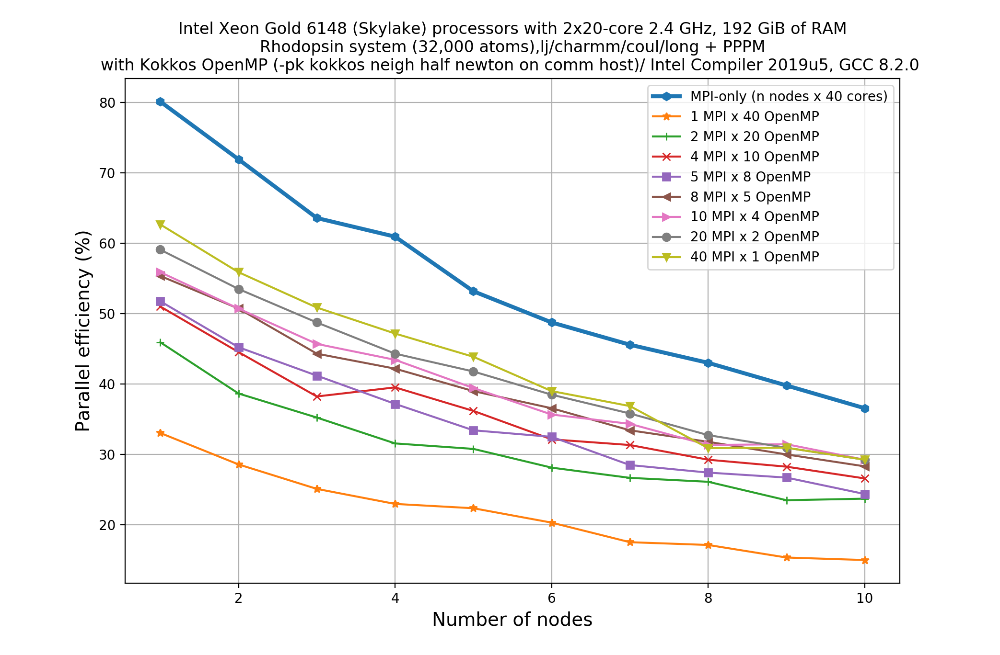

## Kokkos

In recent times, the HPC industry has witnessed a dramatic architectural revolution. Modern HPC architecture
not only includes the conventional multi-core CPUs, but also manycore systems like Xeon Phis or NVIDEA GPUs,
and we don't know yet where this revolution will end up! With the availability of so many cores for computing,
one would naturally expect a 'scalable' speedup in performance. However, this scalability does not come
free-of-cost, this may require several man-years to modify an existing code to make it compatible for new
hardware architectures. Why do we need to modify a code for new architectures? This is because these different
hardwares were designed keeping in mind different philosophies of parallelization and these philosophies keep
updating at more finer levels to enhance the performance. Some of the architectures prefer data-parallelization,
while some of them work better for task-level parallelization. So to access the finer levels of parallelization
offered by modern day architectures, we often need to use parallelizing approaches other than the old classic
MPI-based approach. For example, on a shared memory platform one can use OpenMP, or, on a mixed CPU+GPU platform,
one can use CUDA or OpenACC to parallelize their codes. The major issue with all these approaches is the performance
portability which arises due to complex and varying memory access pattern across devices. So, the question arises:
Is there any way to ease this difficulty?  

Kokkos is probably an answer to this portability issue. The primary objective of Kokkos is to maximize the
amount of user code that can be compiled for various devices but obtaing comparable performance if the code
was written in a  native language specific to that particular device. How does Kokkos achieve this goal? 

1. It maps a C++ kernel to different backend languages like Cuda, OpenMP, Pthreads.
2. It also provides data abstractions to adjust (at compile time) the memory layout of data structures like 2D
   and 3D arrays to optimize performance on different hardware.
   
> ## Kokkos: A developing library
>
> Why should we bother to learn about using Kokkos?
> > ## Solution
> > (Fix Me! "The primary reason for Kokkos being developed is that it allows you to write a *single* pair style in C++ where and without (much) understanding of GPU programming, that will then work on both GPUs (or Xeon Phi) and CPUs with or without multi-threading. It cannot fully reach the performance of USER-INTEL or the GPU package on CPUs and GPUs, but adding new code to those for a pair style, for which something similar already exists, is *significantly* less effort with Kokkos and requires significantly less programming expertise in vectorization and directive based SIMD programming or CPU computing. Also support for a new kind of computing hardware will primarily need additional code in the Kokkos library and just a little bit of programming setup/management in LAMMPS."
> {: .solution}
{: .discussion}

## What is KOKKOS package in LAMMPS?

Kokkos package in LAMMPS is implemented to gain performance with portability. Various pair styles, fixes and atom
styles have been updated in LAMMPS to use the data structures and macros as provided by the Kokkos C++ library so
that when LAMMPS is built with Kokkos feature enabled for a particular hardware, it can provide optimal performance
for that hardware when all the runtime parameters are chosen sensibly. What are the things that it supports currently?

* It can be run on multi-core CPUs, manycore CPUS and Intel Phis and NVIDIA GPUs.
* It provides three modes of execution: Serial (MPI-only for CPUs and Phi), OpenMP (via threading for manycore CPUs
  and Phi), and CUDA (for NVIDIA GPUs)
* It provides reasonable scalability to many OpenMP threads.
* This is specifically designed for one-to-one CPU to GPU ratio
* Care has been taken to minimize performance overhead due to cpu-gpu communication. This can be achieved by ensuring
  that most of the codes can be run on GPUs once assigned by the CPU and when all the jobs are done, it is communicated
  back to CPU, thus minimising the amount of data transfer between CPU and GPU.
* supports modern GPUs only (an extensive list of supported hardwares are given in LAMMPS [website]().
* Currently supports double precision only. 
* Still in developmental stage, so more features and flexibilities are expected in future versions of LAMMPS.

The list of LAMMPS features that is supported by Kokkos is given below:

| Atom Styles | Pair Styles  | Fix Styles  | Compute Style | Bond Styles | Angle Styles | Dihedral Styles | Improper Styles | K-space Styles |
|:----------- |:------------ |:----------- |:------------- |:----------- |:------------ |:--------------- |:--------------- |:-------------- |
| Angle       |Buck/coul/cut | Deform      | Temp          | Fene        | Charm        | Charm           | Harmonic        | Pppm           |
| Atomic      |Buck/coul/long| Langevin    |               | Harmonic    | Harmonic     | Opls            |                 |                |
| Bond        |Etc           | Momentum    |               |             |              |                 |                 |                |
| Charge      |Etc           | Nph         |               |             |              |                 |                 |                |
| Full        |              | Npt         |               |             |              |                 |                 |                |
| Molecular   |              | Nve         |               |             |              |                 |                 |                |
|             |              | Nvt         |               |             |              |                 |                 |                |
|             |              | Qeq/Relax   |               |             |              |                 |                 |                |
|             |              | Reaxc/bonds |               |             |              |                 |                 |                |
|             |              |Reaxc/species|               |             |              |                 |                 |                |
|             |              | Setforce    |               |             |              |                 |                 |                |
|             |              | Wall/reflect|               |             |              |                 |                 |                |


## How to invoke Kokkos package in a LAMMPS run?
You already know how to call an accelerator package in LAMMPS. It was discussed in the previous chapter. The basic
syntax of this command is: `*package style args*`
Obviously, you need to use *kokkos* as *style* with suitable arguments/keywords.

The next you need to choose proper *keywords* and *value* pairs. These *keyword/values* provides you enhanced
flexibility to distribute your job among cpu and gpus in an optimum way. For a quick reference, the following table
could be useful:

 | Keywords |what it does? |Default value |
 |----------|--------------|--------------|
 |neigh|This keyword determines how a neighbour list is built. Possible values are *half*, *full*  | *full* for GPUs and *half* for CPUs|
 |neigh/qeq|  |  |
 |neigh/thread|  |  |
 |newton|sets the Newton flags for pairwise and bonded interactions to off or on |*off* for GPU and *on* for CPU |
 |binsize|sets the size of bins used to bin atoms in neighbor list builds|*0.0* for CPU and 2x larger binsize equal to the pairwise+neighbour skin|
 |comm|It determines whether the cpu or gpu performs the packing and unpacking of data  when communicating per-atom data between processors. values could be *no*, *host* or *device*. *no* means pack/unpack will be done in non-kokkos mode| |
 |comm/exchange|This defines 'exchange' communication which happens only when neighbour lists are rebuilt. Values could be *no*, *host* or *device* | |
 |comm/forward|This defines forward communication and it occurs at every timestep. Values could be *no*, *host* or *device* | |
 |comm/reverse| If the *newton* option is set to *on*, this occurs at every timestep. Values could be *no*, *host* or *device*| |
 |cuda/aware|This keyword is used to choose whether CUDA-aware MPI will be used. In cases where CUDA-aware MPI is not available, you must explicitly set it to *off* value otherwise it will result is an error.|off |


## Rules of thumb

1. ***neigh***: For GPU, a value of *full* for *neigh* keyword is often more efficient, and in case of CPU a value
  of *half* is often faster.
2. ***newton***: Using this keyword you can turn Newton’s 3rd law *on* or *off* for pairwise and bonded interactions.
  Turning this *on* means less computation and more communication, and setting it *off* means interactions will be
  calculated by both processors if these interacting atoms are being handled by these two different processors. This
  results in more computation and less communication. Definitely for GPUs, less communication is often a winsome
  situation. Therefore, a value of *off* for GPUs is efficient while a value of *on* could be faster for CPUs.
3. ***binsize***: Default value is given in the above Table. But there could be exception. For example, if you use
  a larger cutoff for the pairwise potential than the normal, you need to override the default value of *binsize*
  with a smaller value.
4. ***comm*, *comm/exchange*, *comm/forward*, *comm/reverse***: You already know what it does (from the above Table).
  Three possible values are *no*, *host* and *device*. For GPUs, *device* is faster if all the styles used in your
  calculation is Kokkos-enabled. But, if not, it may results in communication overhead due to cpu-gpu communication.
  For CPU-only systems, *host* is the fastest. For Xeon Phi and CPU-only systems, *host* and *device* work identically.
5. ***cuda/aware***: When we use regular MPI, multiple instances of an application is launched and distributed to many
  nodes in a cluster using the MPI application launcher known as *mpirun*. This passes pointers to host memory to MPI
  calls. But, when we want to use CUDA and MPI together, it is often required to send GPU buffers instead of CPU
  buffers. CUDA-aware MPI allows GPU buffers to pass directly through MPI send/receive calls without using
  `cudaMemcpy` which copies data from device to host, and thus CUDA-aware MPI helps to eliminate the overhead due to
  this copying process. But, not all HPC systems have the CUDA-aware MPI available. It results in a *Segmentation*
  *Fault* error at runtime. We can avoid this error by setting its value to *off* (i.e. `cuda/aware off`). But,
  whenever a CUDA-aware MPI is available to you, try to exploit it for a Kokkos/GPU run to get the speedup.
  

## Invoking Kokkos through input file or through command-line?

In episode 5, we learnt how to use USER-OMP or  the GPU package in a LAMMPS run using the *package* command. In this episode, we want to use the *Kokkos* package as an accelerator and the basic syntax to use the *package* remains same. We can invoke this in two alternate ways:

* Edit the input file and introduce  the line comprising the *package* command in it. This is perfectly fine, but
  always remember to use this near the top of the script, before the simulation box has been defined. This is because
  it specifies settings that the accelerator packages use in their initialization, before a simulation is defined.
  An example of calling Kokkos package in a LAMMPS input file is given below:

```
package kokkos neigh full newton off comm no
```
{: .bash}

Additionally, you also need to append an extra "/kokkos" suffix wherever applicable. For example, a pair potential
with Kokkos optimization should be mentioned in the input file as:

```
pair_style      lj/cut/kk 2.5
```
{: .bash}

* A simpler way to do this is through the command-line when launching LAMMPS using the `-pk` command-line switch.
  The syntax would be exactly the same as when used in an input script:

```
srun lmp -in in.lj -k on g 4 -sf kk -pk kokkos newton off neigh full comm device cuda/aware off
```
{: .bash}

The second method appears to be convenient since you don't need to take the hassle to edit the input file
(and possibly in many places)! Note that there is an extra command-line switch in the above command-line. 
Do you know what is this for? To distinguish the various styles of these accelerator packages from its 'regular'
non-accelerated variants, LAMMPS has introduces suffixes and the `-sf` switch  auto-appends these accelerator
suffixes to various styles in the input script. Therefore, when an accelerator package is invoked through the `pk`
switch (for example, `-pk kokkos`), the `-sf` switch ensures that the appropriate style is also being invoked
in the simulation (for example, it ensures that the `lj/cut/kk` is used instead of `lj/cut` as `pair_style`).  

In this tutorial, we'll stick to the second method of invoking the accelerator package, i.e. through the 
command-line.

### Invoking different modes of execution

If you note the above example of commandline call of Kokkos, you can see `-k on g 4`. This has not been discussed
prior to this point. It is used to invoke different modes of execution. In the above example, we are calling the
GPU mode and it will be run with 4 physical GPUs. Similarly, we can call the OpenMP mode (threaded), using something
like: `-k on t 4`. In this case we are invoking Kokkos package to use the OpenMP optimization with 4 threads. In this episode, we'll be discussing about using Kokkos to invoke mixed MPI and OpenMP runs.

## Using OpenMP threading through the Kokkos package
For this exercise also we'll take the rhodopsin system as mentioned in episodes 4 and 5. We shall take the same input file and repeat the same scalability study for the mixed MPI/OpenMP settings as we did it for the USER-OMP package. Well, there is some extra things to do before this when we use the Kokkos OpenMP settings. OpenMP with Kokkos comes with a few extra keywords (refer to the above table). These are *neigh*, *newton*, *comm* and *binsize*.  First thing here that we need to do is to find what values of these keywords offer fastest runs. Once we get to kknow these values, we can use them for all the runs needed to perform the scalability studies.

### Find out the optimum values of the keywords
Take the rhodopsin input files, and run this in 1 node for the following set of parameters as given in the table below. Fill in the blank spaces in the table with the walltimes (in seconds) required for this run. Comment on which set of values give you the fastest runs.

|neigh|newton|comm|binsize|1MPI/40t|2MPI/40t|4MPI/10t|5MPI/8t|8MPI/5t|10MPI/4t|20MPI/2t|40MPI/1t|
|-----|------|----|-------|--------|--------|--------|--------|-------|-------|--------|--------|
|full | off  | no |default|    ?   |    ?   |   ?    |    ?   |   ?   |   ?   |    ?   |   ?    |
|full | off  |host|default|    ?   |    ?   |   ?    |    ?   |   ?   |   ?   |    ?   |   ?    |
|full | off  |dev |default|    ?   |    ?   |   ?    |    ?   |   ?   |   ?   |    ?   |   ?    |
|full | on   | no |default|    ?   |    ?   |   ?    |    ?   |   ?   |   ?   |    ?   |   ?    |
|half | on   | no |default|    ?   |    ?   |   ?    |    ?   |   ?   |   ?   |    ?   |   ?    | 

For the Skylake (AVX 512) system with 40 cores, the results for this input is given below:
|neigh|newton|comm|binsize|1MPI/40t|2MPI/40t|4MPI/10t|5MPI/8t|8MPI/5t|10MPI/4t|20MPI/2t|40MPI/1t|
|-----|------|----|-------|--------|--------|--------|--------|-------|-------|--------|--------|
|full | off  | no |default|  172   |  139   |  123   |  125   |  120  |  117  |  116   |  118   |
|full | off  |host|default|  172   |  139   |  123   |  125   |  120  |  117  |  116   |  118   |
|full | off  |dev |default|  172   |  139   |  123   |  125   |  120  |  117  |  116   |  119   |
|full | on   | no |default|  176   |  145   |  125   |  128   |  120  |  119  |  116   |  118   |
|half | on   | no |default|  190   |  135   |  112   |  119   |  103  |  102  |  97    |  94    |
Comments: 
  1. The choice of *comm* not making practical difference.
  2. Switching on *newton* and using *neigh* equals to *half* make the runs faster for most of the settings.
  So, we'll be using this (i.e. *neigh half newton on comm host*) for all the runs in the scalability studies below.
 
 ### Do the scalability study
 1. Figure out all the possible MPI/OpenMP combinations that you can have per node (just as you did for the USER-OMP runs in episode 5). For example, I did this study in Intel Xeon Gold 6148 (Skylake) processor with 2x20 core 2.4 GHz having 192 GiB of RAM. This means each node has 40 physical cores. So, to satify the relation, *Number of MPI processes* x *Number of OpenMP threads* = *Number of cores per node*, I can have the following combinations per node: 1MPI/40 OpenMP threads, 2MPI/20 OpenMP threads, 4MPI/10 OpenMP threads, 5MPI/8 OpenMP threads, 8MPI/5 OpenMP threads, 10MPI/4 OpenMP threads, 20MPI/2 OpenMP threads, and 40MPI/1 OpenMP threads. I like to see scaling, say up to 10 nodes or more. This means that I have to run a total 80 calculations for 10 nodes since I have 8 MPI/OpenMP combinations for each node. Run the jobs for all possible combinations in your HPC system.
2. Calculate *parallel efficiency* for each of these jobs. To get the total time taken by each job, search for "wall time" in the log/screen output files.
4. Make a plot of *parallel efficiency* versus *number of nodes*.
5. Also, make a comparison of the parallel performance between the USER-OMP and Kokkos implementations of the OpenMP threading.
5. Write down your observation and make comments on any performance enhancement when you compare these results with the pure MPI runs.

### Solution
(Fix me) Write down the observations.

 

