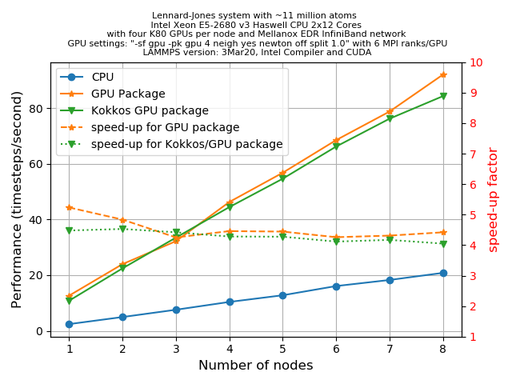

## Using GPU acceleration through the **KOKKOS** package

In this episode, we shall learn to how to use GPU acceleration using the **KOKKOS**
package in LAMMPS. In a
[previous episode]({{page.root}}), we
have learnt the basic syntax of the `package` command that
is used to invoke the **KOKKOS** package in a LAMMPS run. The main arguments and the
corresponding keywords were discussed briefly in that chapter. In this episode, we shall
do practical exercises to get further hands-on experiences on using those commands.

## Command-line options to submit a KOKKOS GPU job in LAMMPS

In this episode, we'll learn to use **KOKKOS** package with GPUs. As we have seen,
to run the **KOKKOS** package the following three command-line switches are very important:
  1. ```-k on``` : This enables KOKKOS at runtime
  2. ```-sf kk``` : This appends the "/kk" suffix to KOKKOS-supported LAMMPS styles
  3. ```-pk kokkos``` : This is used to modify the default package **KOKKOS** options

To invoke the GPU execution mode with KOKKOS, the ```-k on``` switch takes additional
arguments for hardware settings as shown below:
  4. ```-k on g Ngpu```: Using this switch you can specify the number of GPU devices, `Ngpu`,
     that you want to use per node.


> ## Before you start
>
> 1. **Know your host:** get the number of physical cores per node available to you.
> 2. **Know your device:** know how many GPUs are available on your system and know how
>    to ask for them from your *resource manager* (SLURM, etc.)
> 4. **CUDA-aware MPI**: Check if you can use a CUDA-aware MPI runtime with your LAMMPS
>    executable. If not then you will need to add `cuda/aware no` to your `<arguments>`.
{: .callout}

> ## Creating a KOKKOS GPU job script
>
> Create a job script to submit a LAMMPS job for the [LJ system that you studied for the
> **GPU**
> package]({{page.root}}#learn-to-call-the-gpu-package-from-the-command-line)
> such that it invokes the KOKKOS GPU to
> * accelerate the job using 2 nodes,
> * uses all available GPU devices on the node,
> * use the same amount of MPI ranks per node as there are GPUs, and
> * uses the *default* package options.
>
> > ## Solution
> >
> > 
> > 
> > ~~~
> > {{ member }}
> > ~~~
> > {: .language-bash}
> > If you run it how does the execution time compare to the times you have seen for the
> > **GPU** package?
> {: .solution}
{: .challenge}

> ## A few tips on gaining speedup from **KOKKOS**/GPU
>
> This information is collected from the
> [LAMMPS website](https://lammps.sandia.gov/doc/Speed_kokkos.html)
>
> 1. **Hardware comptibility**: For better performance, you must use *Kepler* or later
>    generations of GPUs.
> 2. **MPI tasks per GPU**: You should use one MPI task per GPU because KOKKOS tries to
>    run everything on the GPU, including the integrator and other fixes/computes. One
>    may get better performance by assigning multiple MPI tasks per GPU if some styles
>    used in the input script have not yet been KOKKOS-enabled.
> 3. **CUDA-aware MPI library**: Using this can provide significant performance gain.
>    If this is not available, set it `off` using the `-pk kokkos cuda/aware no` switch.
> 4. **`neigh` and `newton`**: For KOKKOS/GPU, the default is `neigh = full` and
>    `newton = off`. For *Maxwell* and *Kepler* generations of GPUs, the *default*
>    settings are typically the best. For *Pascal* generations, setting `neigh = half`
>    and `newton = on` might produce faster runs.
> 5. **binsize**: For many pair styles, setting the value of `binsize` to twice that
>    used for the CPU styles could offer speedup (and this is the *default* for the
>    KOKKOS/GPU style)
> 6. **Avoid mixing KOKKOS and non-KOKKOS styles**: In the LAMMPS input file, if you use
>    styles that are not ported to use KOKKOS, you may experience a significant loss in
>    performance. This performance penalty occurs because it causes the data to be
>    copied back and forth from the CPU repeatedly.
{: .callout}

In the following discussion, we'll work on a few exercises to get familiarized on some of
these aspects (to some extent).

> ## Exercise: Performance penalty due to use of mixed styles
>
> 1. First, let us take the input and job script for the LJ-system in the last exercise.
>    Make a copy of this script that uses the following additional settings:
>    * `newton off`
>    * `neigh full`
>    * `comm device`
>
>    Use the number of MPI tasks that equals to the number of devices. Measure the performance of
>    of this run in `timesteps/s`.
>
> 2. Make a copy of the LJ-input file called `in.mod.lj` and append the following lines to
>    the end of the file:
>
>    ~~~
>    ... ... ...
>    ... ... ...
>    neighbor	0.3 bin
>    neigh_modify	delay 0 every 20 check no
>
>    compute 1 all coord/atom cutoff 2.5
>    compute 2 all reduce sum c_1
>    variable acn equal c_2/atoms
>
>    fix		1 all nve
>
>    thermo 50
>    thermo_style custom step time  temp press pe ke etotal density v_acn
>    run		500
>    ~~~
>    {: .source}
>
> 3. Using the same KOKKOS setting as before, and the identical
>    number of GPU and MPI tasks as previously, run the job script using the new input file.
>    Measure the performance of this run in `timesteps/s`
>    and compare the performance of these two runs. Comment on your observations.
>
> > ## Solution
> >
> > Taking an example from a HPC system with 2x12 cores per node and 2 GPUs (4 visible devices per
> > node), using 1 MPI task per GPU, the following was observed.
> >
> > First, we ran with `in.lj`. Second, we modified this input as mentioned above (to
> > become `in.mod.lj`) and performance for both of these runs are measured in units of
> > `timesteps/s`. We can get this information from the log/screen output files. The
> > comparison of performance is given in this table:
> >
> > |Input | Performance (timesteps/sec) |  Performance loss |
> > |------|-----------------------------|----------------------------------|
> > |`in.lj` (all KOKKOS enabled styles used)| 8.097                   |                                 |
> > |`in.mod.lj` (non-KOKKOS style used: `compute coord/atom`) | 3.022        |  2.68                           |
> >
> > In `in.mod.lj` we have used styles that are not yet ported to KOKKOS. We can check this
> > from the log/screen output files:
> > ~~~
> > (1) pair lj/cut/kk, perpetual
> >     attributes: full, newton off, kokkos_device
> >     pair build: full/bin/kk/device
> >     stencil: full/bin/3d
> >     bin: kk/device
> > (2) compute coord/atom, occasional
> >     attributes: full, newton off
> >     pair build: full/bin/atomonly
> >     stencil: full/bin/3d
> >     bin: standard
> > ~~~
> > {: .output}
> >
> > In this case, the pair style is KOKKOS-enabled (`pair lj/cut/kk`) while the compute
> > style `compute coord/atom` is not. Whenever you make such a mix of KOKKOS and
> > non-KOKKOS styles in the input of a KOKKOS run, it costs you dearly since this
> > requires the data to be copied back to the host incurring a performance penalty.
> {: .solution}
{: .challenge}

We have already discussed that the primary aim of developing the **KOKKOS** package is to be
able to write a
single C++ code that will run on both devices (like GPU) and hosts (CPU) with or without
multi-threading. Targeting portability without losing the functionality and the performance of a
code is the primary objective of KOKKOS.


> ## Performance comparison of CPU and GPU package (using KOKKOS)
>
> Let us see now see how the current KOKKOS/GPU implementation within LAMMPS (version
> `3Mar20`) achieves this goal by comparing its performance with the CPU and GPU package.
> For this, we shall repeat the same set of tasks as described in
> [episode 5]({{page.root}}#cpu-versus-gpu).
> Take an
> LJ-system with ~11 million atoms by choosing `x = y = z = 140` and `t = 500`.
>
> **KOKKOS**/GPU is also specially designed to run
> everything on the GPUs (in this case there are 4 visible devices). We shall offload
> the entire force computation and neighbour
> list building to the GPUs using the `<arguments>`:
>
> ```
> -k on g 4 -sf kk -pk kokkos newton off neigh full comm device
> ```
> {: .bash}
> or, if *CUDA-aware MPI* is not available to you,
> ```
> -k on g 4 -sf kk -pk kokkos newton off neigh full comm device cuda/aware off
> ```
> {: .bash}
>
>
> We have created a plot to compare the performance of the **KOKKOS**/GPU runs with the CPU runs
> (i.e. without any accelerator package) and the **GPU** runs (i.e. with the **GPU**
> package enabled) with various numbers of nodes:
>
> <p align="center"></p>
>
> Discuss the main observations you can make from this plots.
>
> > ## Solution
> >
> > There is only marginal difference in the performance of the **GPU** and **KOKKOS**
> > packages. The hardware portability provided by KOKKOS therefore make it an attractive
> > package to become familiar with since it is actively maintained and developed and likely
> > to work reasonably well on the full spectrum of available HPC architectures (ARM CPUs, AMD
> > graphics cards,...) going forward.
> >
> > A caveat on these results however, at the time of their generation mixed precision
> > support in the LAMMPS KOKKOS package was still under development. When running large
> > number of atoms per GPU, KOKKOS is likely faster than the **GPU** package when compiled
> > for double precision. It is likely that there is additional benefit of using single
> > or mixed precision with the **GPU** package (depending significantly on the hardware
> > in use and the simulated system and pair style.
> >
> {: .solution}
{: .challenge}
